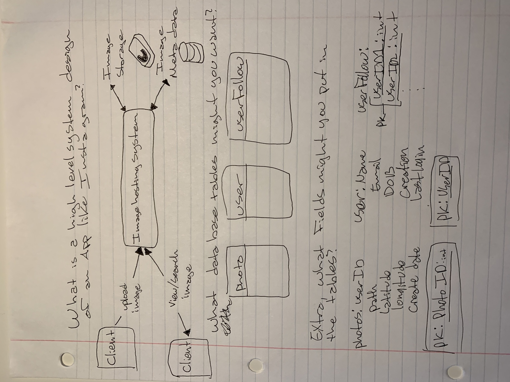
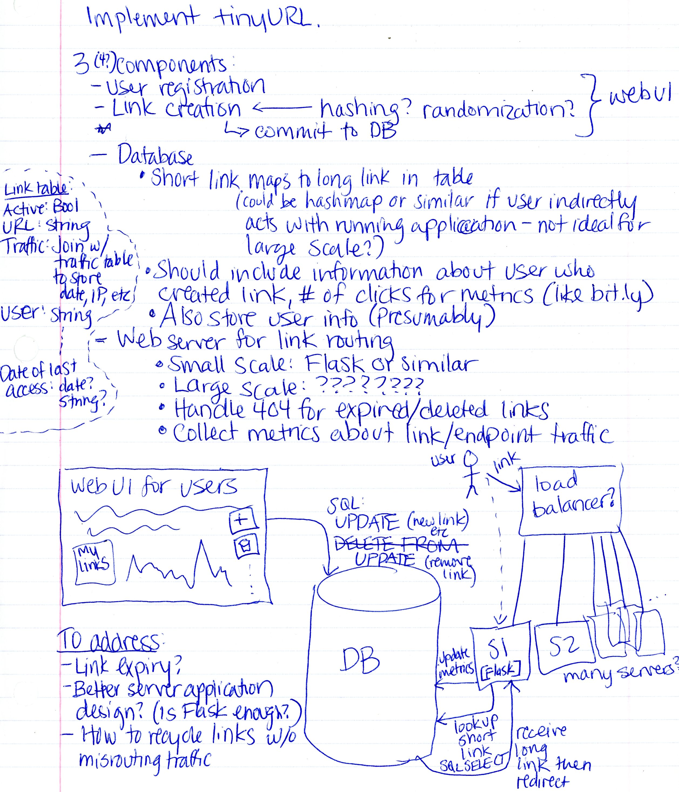

# Miscellaneous Coding & System Design

Problems and solutions for Miscellaneous Coding & System Design session on May 17, 2019.

## Background

The goal of this session is to get attendees to think about large-scale 
engineering problems that you might encounter in the real world. If your 
manager asked you to implement an entire project, how would you go about 
doing so? How would you design it?

These questions are common in real-world interviews, including interviews 
with major technology firms (i.e. FAANG). 

Some key tips from the CTCI chapter on the subject (Chap. 9):

- **Communicate your ideas clearly.** You are in charge of how this 
  system gets implemented; show your interviewer that you are thinking 
  about what the system would require to function as desired.
- **Use the whiteboard.** Draw pictures and diagrams. Make lists of 
  questions, ideas, and potential difficulties. This will help your 
  interviewer _see_ your though process, quite literally.
- **Keep the design broad.** Do not get bogged down with minute details 
  at the beginning of your design. If the system is a house, it needs 
  a solid foundation before it needs framing, drywall, or decorations.
- **Make reasonable assumptions, and listen to your interviewer.** When 
  working on a problem, you have to make assumptions about data availability, 
  technology stacks, user traffic, system memory, and many other things. 
  Start with assumptions that seem reasonable. If your interviewer is 
  looking for specific use cases, listen to them carefully and consider 
  how you might incorporate them.
- **Handle issues as best you can.** When whiteboarding a design, you 
  will, almost inevitably, discover a problem with your design. That's 
  okay. Sketch out as much of your design as you can, make note of the 
  issues you encounter, and rework the design to solve or mitigate the 
  issue (if you can, or if you have time to).
- **Do your best.** There is no such thing as a perfect system, and no 
  reasonable person would expect you to design one in an interview. Work 
  hard to communicate your ideas and flesh out an idea based on your 
  existing knowledge.

For more specific information about designing systems to be scalable, 
limiting factors in system design, and the problem-solving process, 
we recommend reading the Cracking the Coding Interview chapter on the 
subject.

## Problems

### 1. Flight Reservations

Source: Tom Blanchard

#### Scenario

A plane has 300 seats; 50 first class seats, 50 comfort seats and 200 economy seats.
The airline must have a way for customers to reserve their seats. How would you design a system for 
keeping track of customers reserving seats, managing confirmations, and making sure that 
seats on the plane are not over booked. Create a UML class diagram illustrating the 
relationship between any classes you would need to represent this reservation system.

### 2. Instagram

Source: Alex van Zuiden-Rylander

#### Scenario

- What is a high-level system design of a photo sharing app, like instagram? 
- What database tables might you want to use to store data? 
- Extra: what fields might you want to put in the tables?

### 3. TinyURL

Source: CTCI Chapter 9

#### Scenario

Design a service that produces and manages minified URLs.

#### Questions to Consider

1. As a user, how would you use such a service? What would you expect 
   from the service?
2. What are some core (necessary) features of such a service? Are there 
   additional features that would be useful?
3. How would you store the destination URL? How would you generate it?
4. Should minified links expire?
5. Do you need to make any considerations for deploying this system?

Example use cases:

- A marketing manager might want to generate a short, memorable link 
  to a long URL for advertising a service on billboards or on the radio.
- Providing a single link to a resource that might change over time 
  so that the short link can be consistent even if the corresponding 
  long link might change.
- Specific examples of links that would benefit from short links:
  - https://github.com/UWB-ACM/CTCI/blob/master/Spring-2019/linked_lists/Reverse_Nodes_In_k-Group/ReverseLinkedList.cpp
  - https://www.google.com/maps/place/University+of+Washington+Bothell+Library/@47.7596,-122.1962305,16.23z/data=!4m5!3m4!1s0x54900e6449b9be3d:0x2dd46fc8c43b08bd!8m2!3d47.7599151!4d-122.1913241
  - https://smile.amazon.com/ap/signin?_encoding=UTF8&openid.assoc_handle=amzn_smile&openid.claimed_id=http%3A%2F%2Fspecs.openid.net%2Fauth%2F2.0%2Fidentifier_select&openid.identity=http%3A%2F%2Fspecs.openid.net%2Fauth%2F2.0%2Fidentifier_select&openid.mode=checkid_setup&openid.ns=http%3A%2F%2Fspecs.openid.net%2Fauth%2F2.0&openid.ns.pape=http%3A%2F%2Fspecs.openid.net%2Fextensions%2Fpape%2F1.0&openid.pape.max_auth_age=0&openid.return_to=https%3A%2F%2Fsmile.amazon.com%2Fgp%2Fcharity%2Fhomepage.html%3Fie%3DUTF8%26newts%3D1%26orig%3DLw%253D%253D

## Solutions

### 1. Flight Reservation UML Class Diagram
This diagram can be located in `Spring-2019/system_design_misc_coding/Flight_Reservation/Flight_Reservation_System.png`

### 2. Instagram

Source: Alex van Zuiden-Rylander

#### Diagrams and System Sketches

### 3. TinyURL

Source: CTCI Chapter 9

#### Taking a First Crack at the Problem

Here's a rough sketch of ideas, potential system components, and 
design considerations:

#### A Short Writeup

TinyURL would have 2 primary classes of customers:

- Users who generate and manage links
- Individuals who receive the distributed links and visit the link (and 
  get redirected to the target destination)

To serve the first class of users effectively, two considerations 
are needed. 
1. The customer might just require a single quick link, and doesn't need 
   an account with the service.
2. The customer might want to register an account to generate and manage 
   many links for a specific entity or project.

For the first class of customer, the links should be generated without 
requiring login credentials.

For the second class of customer, a web-based UI with 
registration and account persistence makes the most sense. Users can log 
in, create links, and update/delete links as desired. 
This is also a good opportunity to provide a rich set of features to 
incentivize account creation (or even paid accounts); metrics reporting, 
custom URL endpoint names, and other options can be incorporated into 
the system implementation.

To serve the second class of customers, a web server (or cluster of 
servers) would need to receive the traffic for the minified URL and 
redirect the visitor to the target URL.

A database is needed to store the minified links, along with other pertinent 
information about the link. Using a database would allow for tracking 
the number of hits for the link, whether the link is active or 
expired/deleted, and other useful information as necessary. The database 
might also contain a separate table for the traffic associated with the 
links, so that the IP address and access date for each individual hit 
can be tracked.

Additionally, user information (credentials, created links, etc.) will 
be stored in the database as applicable.

The web server(s) used to serve the minified links is a subset of this 
system that requires careful design inofitself. The expected traffic for 
the link service is the most important consideration for implementation 
details. The diagram above describes an outline for using a load 
balancer to ensure individual servers do not get overwhelmed with traffic, 
and each individual server will be able to connect with a centralized 
database. The web application handling the database access requests 
each time a link is accessed could be a number of platforms; `Flask` 
has been proposed for small-scale solutions.
