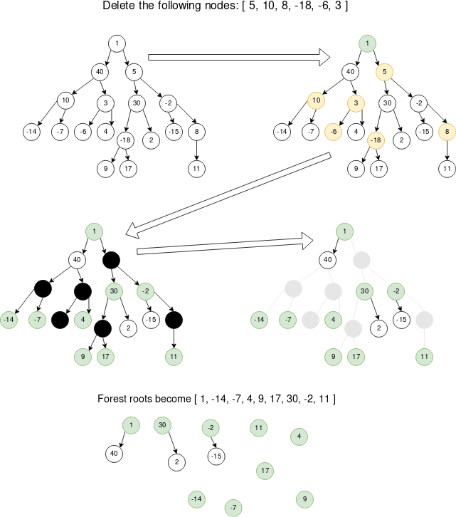

<!-- Don't remove -->
<a name="top"/>

# Trees

Problems and solutions for Trees session on November 1, 2019.

### Table of Contents

* [Problems](#problems)
  * [1](#p1)
  * [2](#p2)
  * [3](#p3)
* [Solutions](#solutions)
  * [1](#s1)
  * [2](#s2)
  * [3](#s3)

<!-- Don't remove -->
<a name="problems"/>

## Problems

<a name="p1"/>

### 1. PROBLEM 1 TODO :bug:

Source: TODO :bug:

#### Scenario

Problem Statement TODO :bug:

#### Example Input

If the problem is simple enough, remove this section. TODO :bug:

#### Function Signature

TODO :bug:

<!-- Don't remove -->
Go to [Solution](#s1)   [Top](#top)

<!-- Don't remove -->
<a name="p2"/>

### 2. PROBLEM 2 TODO :bug:

Source: TODO :bug:

#### Scenario

Problem Statement TODO :bug:

#### Example Input

If the problem is simple enough, remove this section. TODO :bug:

#### Function Signature

TODO :bug:

<!-- Don't remove -->
Go to [Solution](#s2)   [Top](#top)

<!-- Don't remove -->
<a name="p3"/>

### 3. Delete Nodes and Return Forest

Source: [LeetCode](https://leetcode.com/problems/delete-nodes-and-return-forest/)

#### Scenario

You are given a tree, where each node in the tree has 
a distinct value. You are also given a structure with 
a selection of values to be deleted from the tree.

When a node is deleted from the tree, that node's 
children become the roots of their own remaining 
subtrees. The new set of tree roots form a forest.

Write a method which deletes the specified nodes, and 
return a collection of the root nodes of the trees in 
the remaining forest.

#### Example Input



#### Function Signature

C++:

```c++
/**
 * Node may be defined as:
 * struct Node {
 *     int data;
 *     Node* left = nullptr;
 *     Node* right = nullptr;
 * };
 */

vector<Node*> deleteForest(Node* root, vector<int> deleteVals) {
    // your code here
}
```

Java:

```
/**
 * Node may be defined as:
 * public class Node {
 *     public int data;
 *     public Node left;
 *     public Node right;
 * }
 */

public ArrayList<Node> deleteForest(Node root, int[] deleteVals) {
    // your code here
}
```

<!-- Don't remove -->
Go to [Solution](#s3)   [Top](#top)

<!-- Don't remove -->
<a name="solutions"/>

## Solutions

<!-- Don't remove -->
<a name="s1"/>

### 1. SOLUTION 1 TODO :bug:

Source: TODO :bug:

#### Naive/Simple Solution

TODO :bug:

#### Optimal Solution

TODO :bug:

#### Testing The Solutions OR Driver For Solution

TODO :bug:

<!-- Don't remove -->
Go to [Top](#top)

<!-- Don't remove -->
<a name="s2"/>

### 2. SOLUTION 2 TODO :bug:

Source: TODO :bug:

#### Naive/Simple Solution

TODO :bug:

#### Optimal Solution

TODO :bug:

#### Testing The Solutions OR Driver For Solution

TODO :bug:

<!-- Don't remove -->
Go to [Top](#top)

<!-- Don't remove -->
<a name="s3"/>

### 3. SOLUTION 3 TODO :bug:

Source: TODO :bug:

#### Naive/Simple Solution 

TODO :bug:

#### Optimal Solution

TODO :bug:

#### Testing The Solutions OR Driver For Solution

TODO :bug:

<!-- Don't remove -->
Go to [Top](#top)
