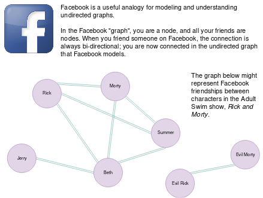
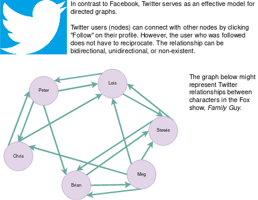

<!-- Don't remove -->
<a name="top"/>

# Graphs

Problems and solutions for Graphs session on November 8, 2019.

### Table of Contents

* [Background](#background)
* [Problems](#problems)
  * [1](#p1)
  * [2](#p2)
  * [3](#p3)
* [Solutions](#solutions)
  * [1](#s1)
  * [2](#s2)
  * [3](#s3)

<!-- Don't remove -->
<a name="background"/>

## Background

### What is a graph?

A graph is a data structure that organizes and shows relationships 
between individual data nodes. However, a graph is not organized in a 
heirarchal way the way a tree is. Nodes in a graph are not required 
to be connected, and connections (or _edges_) between nodes can be 
created and destroyed dynamically.

It is useful to observe that a tree is a form of a directed graph. The 
edges are the connections leading to child nodes. In a tree, a 
strict one-to-many relationship between nodes and their children is 
required; generic graphs do not have this requirement.

### Why are graphs important?

Graphs are meaningful in the context of computer science because they 
are an excellent model for entity relationships in many systems. For 
example, most social media interactions can be represented using graphs.

If you are skeptical about the importance of graphs in computer science, 
you should bear in mind that many highly competitive employers require 
a thorough understanding of graphs and algorithms related to their 
traversal and representation. If you want anecdotal examples of this, 
feel free to ask.

### Undirected Graphs

Undirected graphs have _bidirectional_ edges; any connection between 
individual nodes is reflexively mirrored by the other, and the edge 
can be traversed in either direction.

Facebook friendships are a useful analogy for undirected graphs; when 
two people become friends on Facebook, both people are friends with 
each other.



### Directed Graphs

Directed graphs have _unidirectional_ edges; an outbound edge to 
another node is not necessarily reciprocated. Twitter serves as a 
model for this kind of relationship.



### Representing Graph Edges

There are two common ways of representing edges between nodes in a 
graph:

* An **adjacency list**
* An **adjacency matrix**

An adjacency list is unique to the node which owns it, and contains 
pointers or references to the nodes it is connected to. Depending on 
the structure of the graph, the lists may vary in size and contents. 
We can represent the adjacency list with a `list`, `set`, or `map` 
depending on the properties of the graph and the programmer's preference.

An adjacency matrix is a fixed-size structure, unlike the list equivalent, 
and is 2-dimensional. Each possible node relationship (such as from 
node A to node B) is referenced by the index pattern `matrix[A][B]`, 
and the value at that cell is indicative of the existence of the 
relationship. For example, for a directed graph, we might generate 
an `N x N` matrix of boolean values, and when an edge is created 
between nodes, we set the value of that cell to `true`; otherwise, the 
value of the cell is `false`.

### Weighted Graphs

Until now, we have looked at graphs whose connections do not have any 
special qualities. A common quality that graph edges might possess are 
_weights_. Weights are usually associated with a cost or benefit of 
the relationship between the nodes. 

Consider a graph which represents 
a map of highways between major US cities. Each graph edge, representing 
a highway, might have a _weight_ that represents the number of miles 
between those cities using that highway. This data structure can be 
used to calculate the shortest route between two different cities, 
for example. For more information about this subclass of problems, 
we recommend reading about 
[Dijkstra's Algorithm](https://en.wikipedia.org/wiki/Dijkstra's_algorithm).

Go to [Top](#top)

<!-- Don't remove -->
<a name="problems"/>

## Problems

<a name="p1"/>

### 1. Find Mutual Friends 

Source: Lizzy

#### Scenario

Imagine a Facebook-esque social network that is represented by a graph. Each vertex represents a person's account, 
and the edges between vertices represent friend status.

Write a method that counts the number of mutual friends between two people.

You can assume the `Vertex` class/struct is defined as follows:

```
class Vertex {
    string name;
    set<Vertex> friends;
}
```

#### Function Signature

```java
int findMutualFriends(Vertex p1, Vertex p2) {
    // your code here
}
```

<!-- Don't remove -->
Go to [Solution](#s1)   [Top](#top)

<!-- Don't remove -->
<a name="p2"/>

### 2. PROBLEM 2 TODO :bug:

Source: TODO :bug:

#### Scenario

Problem Statement TODO :bug:

#### Example Input

If the problem is simple enough, remove this section. TODO :bug:

#### Function Signature

TODO :bug:

<!-- Don't remove -->
Go to [Solution](#s2)   [Top](#top)

<!-- Don't remove -->
<a name="p3"/>

### 3. Boggle

Source: Lizzy

#### Scenario

In the [game of Boggle](https://en.m.wikipedia.org/wiki/Boggle), 16 
dice with English letters are arranged in a 4x4 grid, and players 
identify as many real words as they can in 3 minutes.

A "real word" is constructed by stringing adjacent characters together 
to form a common English word. Unique die faces which have been 
used to construct a word may not be reused in that same word. 
Adjacent characters include letters which are diagonally adjacent as 
well as letters which are orthogonally adjacent.

Given a 2D array which represents a legal Boggle board and a string, 
determine whether the string could be legally produced from the 
board.

_Bonus: what if you wanted to find all valid words in a given board? 
What kind of structures would you need? How would your implementation 
change?_

#### Example Input

Input:

```
board:  v e i e
        l v t w
        r e n x
        w m p i

string: interview
```

Output: `true`

Explanation: The word "interview" is formed by tracing the word 
from the bottom right-hand cell.

Input:

```
board:  v e i e
        l v t w
        r e n x
        w m p i

string: tent
```

Output: `false`

Explanation: We can form 't', 'te', and 'ten', but we cannot legally 
form 'tent' in this board.

#### Function Signature

**D**esign **I**t **Y**ourself

<!-- Don't remove -->
Go to [Solution](#s3)   [Top](#top)

<!-- Don't remove -->
<a name="solutions"/>

## Solutions

<!-- Don't remove -->
<a name="s1"/>

### 1. Find Mutual Friends

Source: Tom, Lizzy, Google 

#### Naive/Simple Solution

The solution for this problem is to find the intersection of both input 
vertices set of friends. This solution copies one input vertex's set of friends into a `HashSet`,
calls `retainAll` method on this set, which iterates through the set while checking
if the next node is contained in the other input vertex's set of friends. If it is not, the `retainAll`
method will remove the node the iterator is pointing to and move to the next, leaving only common nodes (or mutual
friends) of both vertices. At this point, to get the count of mutual friends, access the size of the modified set
where vertex1 intersects vertex2. 

The other thing to note is that this implementation's Vertex class scopes the `Set` members to private, hence the 
`getFriends()` method call.

Java Implementation:
```java
int findMutualFriends(Vertex p1, Vertex p2) {
        Set<Vertex> intersection = new HashSet<>(p1.getFriends());
        intersection.retainAll(p2.getFriends());
        return intersection.size();
    }
```

#### Driver For Solution

[The java solution is here.](./find_mutual_friends/mutual.java)

<!-- Don't remove -->
Go to [Top](#top)

<!-- Don't remove -->
<a name="s2"/>

### 2. SOLUTION 2 TODO :bug:

Source: TODO :bug:

#### Naive/Simple Solution

TODO :bug:

#### Optimal Solution

TODO :bug:

#### Testing The Solutions OR Driver For Solution

TODO :bug:

<!-- Don't remove -->
Go to [Top](#top)

<!-- Don't remove -->
<a name="s3"/>

### 3. Boggle

Source: Lizzy

#### Solution 

We can envision this board as an undirected unweighted graph. 
Each die is a node, and all neighboring dice have edges connecting 
them. When we find a word in the board, the word is represented by 
a specific traversal route across the graph.

We can choose to traverse the graph depth- or breadth-first; our 
solution traverses depth-first using a recursive function.

Because we don't want to repeat our usage of dice when we are forming 
a word, we must track which nodes we have "visited", or included in 
our word formation, up until this point. The provided solution uses 
a set, but can be another structure of your choosing.

To begin the solution we call a method that is called `solve` in 
this example. `solve` calls our recursive depth-first search 
function for each cell in the grid.

```python
def solve(grid, word):
    if not grid or not word:
        return False
    for row in range(len(grid)):
        for col in range(len(grid[row])):
            if dfs(grid, word, 0, row, col, set()):
                return True
    return False
```

Our recursive function does the following:

1. Check for base cases which might cause the current search path to 
   terminate as either true or false (see code for details).
2. Otherwise, we can proceed by searching surrounding cells. We mark 
   the current cell as visited and call our recursive function on 
   the surrounding cells, returning the inclusive OR of the result.

```python
def dfs(grid, word, word_idx, row, col, visited):
    # handle edge cases:
    # 1. check to ensure we have not processed entire word
    # 2. check to ensure our indices are still in bounds
    # 3. check to make sure we haven't visited this node
    if word_idx >= len(word): return True
    if row < 0 or row >= len(grid): return False
    if col < 0 or col >= len(grid[0]): return False
    if (row, col) in visited: return False
    # we are still traversing graph; now, check for letter alignment
    if grid[row][col] != word[word_idx]:
        # letters are mismatched; terminate this search
        return False
    # keep searching; search in all 8 directions from current node
    visited.add((row, col))
    return dfs(grid, word, word_idx + 1, row + 1, col, visited) or  \
            dfs(grid, word, word_idx + 1, row + 1, col + 1, visited) or \
            dfs(grid, word, word_idx + 1, row + 1, col - 1, visited) or \
            dfs(grid, word, word_idx + 1, row, col + 1, visited) or \
            dfs(grid, word, word_idx + 1, row, col - 1, visited) or \
            dfs(grid, word, word_idx + 1, row - 1, col + 1, visited) or \
            dfs(grid, word, word_idx + 1, row - 1, col - 1, visited) or \
            dfs(grid, word, word_idx + 1, row - 1, col, visited)
```

#### Bonus Question Solution

_Bonus: what if you wanted to find all valid words in a given board? 
What kind of structures would you need? How would your implementation 
change?_

Since our problem here has become more generic, we would do away with 
matching individual characters based on an input string. However, we 
require a set of words to compare our traversal path against. To 
validate a specific path in the board, we can use one of two structures: 

1. A "dictionary" of words, usually given as a `set`.
2. A prefix tree, or [trie](https://en.wikipedia.org/wiki/Trie).

For efficiency and elegant alignment with node traversal, a trie is 
preferred. The reasons for this make for a good brain exercise; 
feel free to ask why. 

Now, when we are performing depth-first search of our board, we want 
to have a way to reconstruct the word we are currently building. A 
simple implementation would be to have the existing word passed in as 
an argument to `dfs` so we can just append the current letter.

Each time we append a letter, we can check it against our valid word 
list to see if we found a valid word. If that's the case, we want to 
store the word somewhere. Because `dfs` is recursive, we have to be 
careful about how we handle this requirement; a wrapper class around 
a list/array is the most straightforward approach. Possible duplicate 
words should be addressed in the solution.

#### Driver For Solution

For the basic problem, the [solution](./boggle/solution.py) and 
[driver](./boggle/driver.py) are available. The solution's output is:

```console
$ python driver.py

Board:
v e i e 
l v t w 
r e n x
w m p i 

For word 'interview', the result is True
For word 'tent', the result is False

Board:


For word 'a', the result is False

Board:
a 

For word 'a', the result is True
For word 'i', the result is False
```

A coded solution for the bonus problem has not been provided and 
has been left as an exercise for the reader.

<!-- Don't remove -->
Go to [Top](#top)
