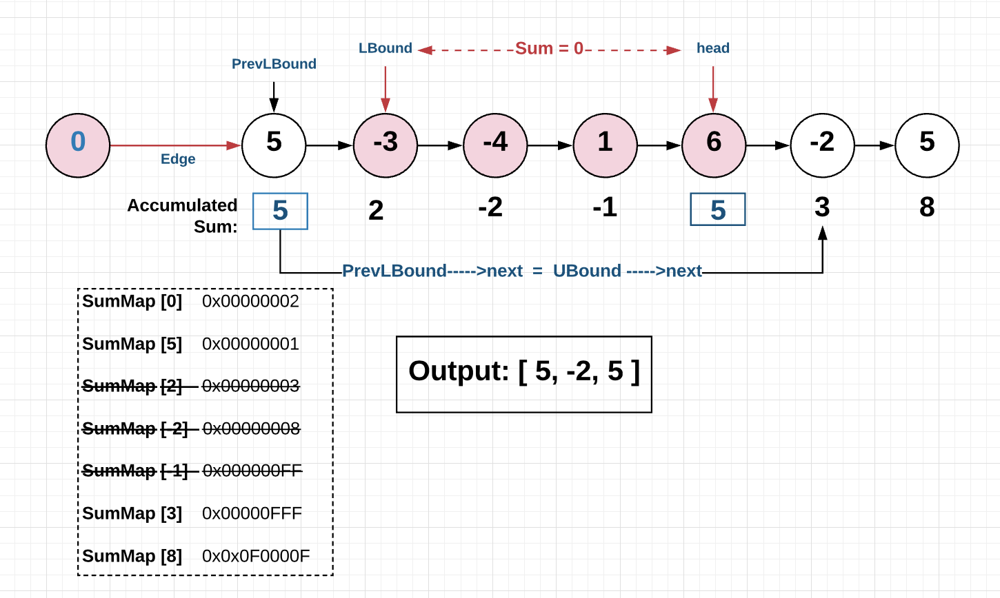

<!-- Don't remove -->
<a name="top"/>

# Linked List Manipulation

Practice solving linked list related problems. Session on May 1, 2020.

### Table of Contents

* [Problems](#problems)
  * [1](#p1)
  * [2](#p2)
  * [3](#p3)
* [Solutions](#solutions)
  * [1](#s1)
  * [2](#s2)
  * [3](#s3)

<!-- Don't remove -->
<a name="problems"/>

## Problems

<a name="p1"/>

### 1. PROBLEM 1 TODO :bug:

Source: TODO :bug:

#### Scenario

Problem Statement TODO :bug:

#### Example Input

If the problem is simple enough, remove this section. TODO :bug:

#### Function Signature

TODO :bug:

<!-- Don't remove -->
Go to [Solution](#s1)   [Top](#top)

<!-- Don't remove -->
<a name="p2"/>

### 2. Remove Zero Sum Consecutive Nodes from Linked List

[LeetCode](https://leetcode.com/problems/remove-zero-sum-consecutive-nodes-from-linked-list/)

#### Scenario

Given the head of a linked list, we repeatedly delete consecutive sequences of nodes that sum to 0 until there are no such sequences in the list.

After removing all consecutive nodes that sum to 0, print the final linked list (e.g. [3, 5, 8]). If all nodes are removed, print out the empty list (e.g. []).

(Note that in the examples below, all sequences are serializations of ListNode objects.)

#### Example Input
##### Example 1: <br>
```
Input: head = [1,2,-3,3,1]
Output: [3,1]
```
##### Example 2:<br>
```
Input: head = [5,-3,-4,1,6,-2,5]
Output: [5,-2,5]
```
#### Function Signature
```C++
// Definition for singly-linked list.
struct ListNode {
  int val;
  ListNode *next;
  ListNode(int x) : val(x), next(NULL) {}
};
ListNode* removeZeroSumSublists(ListNode* head) {
     // your code goes here

}
```
<!-- Don't remove -->
Go to [Solution](#s2)   [Top](#top)

<!-- Don't remove -->
<a name="p3"/>

### 3. PROBLEM 3 TODO :bug:

Source: TODO :bug:

#### Scenario

Problem Statement TODO :bug:

#### Example Input

If the problem is simple enough, remove this section. TODO :bug:

#### Function Signature

TODO :bug:

<!-- Don't remove -->
Go to [Solution](#s3)   [Top](#top)

<!-- Don't remove -->
<a name="solutions"/>

## Solutions

<!-- Don't remove -->
<a name="s1"/>

### 1. SOLUTION 1 TODO :bug:

Source: TODO :bug:

#### Naive/Simple Solution
<details>
<summary>Click to see solution</summary>

TODO put your solution here :bug:

</details>


#### Optimal Solution

<details>
<summary>Click to see solution</summary>

TODO put your solution here :bug:

</details>

#### Testing The Solutions OR Driver For Solution

TODO :bug:

<!-- Don't remove -->
Go to [Top](#top)

<!-- Don't remove -->
<a name="s2"/>

### 2. Remove Zero Sum Consecutive Nodes from Linked List

#### Naive/Simple Solution

<details>
<summary>Click to see solution</summary>

// NOTE: This solution does not take into account memory leaks. <br>
The idea is to use an outer loop iterating through N nodes, at every node i-th we use a nested loop iterating to the end of the list to check whether or not that node and the following nodes cause a zero-sum. The list of nodes causes zero-sum if "the accumulated sum of all nodes in that list equals zero". The inner loop stops as the accumulated sum equals 0 ``Sum == 0`` or it reaches the end of the list.
- If zero-sum list is found by the inner loop ``Sum == 0``, we de-list nodes from nodes [LBound, UBound] including the LBound node and the UBound node, where the node UBound is the node that the inner loop stopped at as the ``Sum == 0``.
- If ``Sum != 0``, the inner loop continues till the end of the list ``UBound == NULL``, which means there is no zero-sum found, then the outer loop will repeat the same searching process beginning at the next nodes till the end of the list.

For every i-th node of N nodes, the algorithm iterates from node i-th to the last node for the total of ``N * (N - i)`` times. Therefore, this solution has time complexity of ``O(N^2)``. Space complexity is ``O(1)``.

```C++
ListNode* removeZeroSumSublists(ListNode* head) {
    ListNode *Edge, *PreLBound, *UBound;
    // create edging node
    Edge= new ListNode(0);
    Edge->next = head;
    PreLBound = Edge;
    UBound = head;
    int Sum=0;
    while(UBound)
    {
        Sum = Sum + UBound->val;

        // if  zero-sum list of nodes is found [LBound,UBound]
        // where LBound == PreLBound->Next;
        // then modify the list to remove nodes from LBound to UBound
        if(Sum == 0) {
            PreLBound->next = UBound->next;
        }
        UBound = UBound->next;
        // no zero-sum found in the range [Prev, End]
        // outer loop continues checking beginning at the next node
        if(UBound == NULL)
        {
            PreLBound = PreLBound->next;
            // end of list
            if(PreLBound == NULL) break;
            UBound = PreLBound->next;
            Sum=0;
        }
    }
    // returning the result without the edging node
    return Edge->next;
}
```

</details>

#### Optimal Solution
<details>
<summary>Click to see solution</summary>
// NOTE: This solution does not take into account memory leaks.<br>
Another approach is to check for the repetition of the accumulated sum that is defined by ``Sum = Sum + head->val``. Tracking the accumulated sum of each node is optimized by using the hash table ``map<int,NodeList*> SumMap``.
- If the accumulated sum at node ``head`` is found in ``SumMap`` (accumulated Sum is repeated), this means there is a zero-sum list between the two nodes ``[LBound, head]`` that needs to be removed. After removing the zero-sum list, make sure you reset the node before the ``LBound`` to the one after the ``head``.
- If ``Sum`` is not repeated (not found in SumMap), this means the current node is not contributing to the zero-sum list, the accumulated sum at the current is recorded ``SumMap[Sum] = head``, and the loop continues till the end of the list.
Instead of going through ``N-i`` nodes for every node i-th to calculate the accumulated sum that is explained in the first solution, this solution uses a hash table to record the accumulated sum of visited nodes and only goes through the list once. Time complexity of this solution is ``O(N)``. The space complexity of ``O(N)`` is the trade-off.

###### The following diagram illustrates how the algorithm works.



```C++
ListNode* removeZeroSumSublists(ListNode* head) {
    // create edging node. Reason explained above.
    ListNode* Edge =new ListNode(0);
    Edge->next=head;
    // unordered map is faster with inserting/removing
    unordered_map<int,ListNode*> SumMap;
    SumMap[0] = Edge;
    int Sum = 0;

    while(head != nullptr){
        Sum += head->val;
        // if found zero-sum range: [LBound,head]
        // then delete from SumMap Sums recorded between [LBound,head]
        // then re-link PrevLBound to head->Next
        if(SumMap.find(Sum) != SumMap.end()) {
            ListNode* LBound = SumMap[Sum];
            ListNode* PreLBound = LBound;

            //delete Sums recorded in range [LBound, head]
            int subSum = Sum;
            while(LBound != head){
                LBound = LBound->next;
                subSum += LBound->val;
                if(LBound != head) SumMap.erase(subSum);
            }
            // remove nodes from Lbound to head
            PreLBound->next = head->next;
        } else {
            // if zero-sum range NOT exist
            // record Sum for further tracking
            SumMap[Sum] = head;
        }
        // examine next node
        head = head->next;
    }
    // returning the result without the edging node
    return Edge->next;
}
```

</details>

#### Driver For Solution

See [Driver](./ZeroSumConsec/ZeroSumConsec.cpp)

<!-- Don't remove -->
Go to [Top](#top)

<!-- Don't remove -->
<a name="s3"/>

### 3. SOLUTION 3 TODO :bug:

Source: TODO :bug:

#### Naive/Simple Solution

<details>
<summary>Click to see solution</summary>

TODO put your solution here :bug:

</details>

#### Optimal Solution

<details>
<summary>Click to see solution</summary>

TODO put your solution here :bug:

</details>

#### Testing The Solutions OR Driver For Solution

TODO :bug:

<!-- Don't remove -->
Go to [Top](#top)
