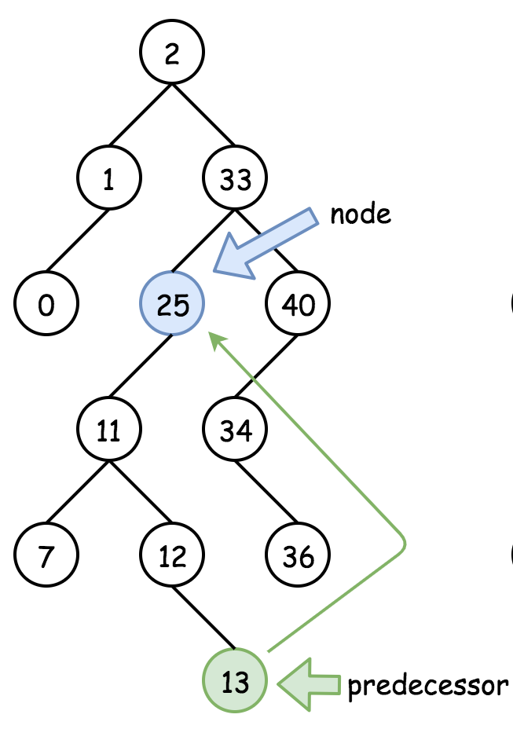
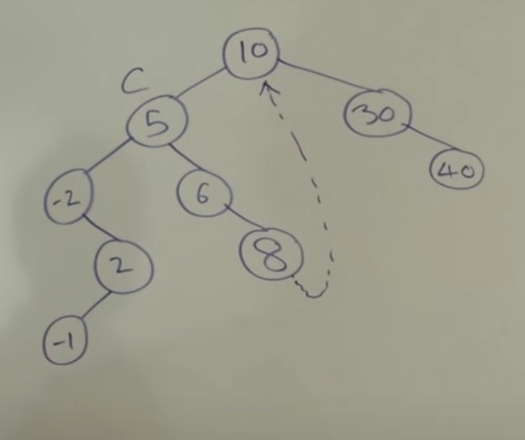

<!-- Don't remove -->
<a name="top"/>

# Trees

Problems and solutions for Trees session on May 8, 2020.

### Table of Contents

* [Problems](#problems)
  * [1](#p1)
  * [2](#p2)
  * [3](#p3)
* [Solutions](#solutions)
  * [1](#s1)
  * [2](#s2)
  * [3](#s3)

<!-- Don't remove -->
<a name="problems"/>

## Problems

<a name="p1"/>

### 1. Lowest Common Ancestor

Source: [LeetCode](https://leetcode.com/problems/lowest-common-ancestor-of-a-binary-search-tree/)

#### Scenario

Given a binary search tree (BST), find the lowest common ancestor (LCA) 
of two given nodes in the BST.

Paraphrased from the [definition of LCA on Wikipedia](https://en.wikipedia.org/wiki/Lowest_common_ancestor): 

> In an arbitrary tree `T`, there exists two nodes `p` and `q`. The 
lowest common ancestor (LCA) of `p` and `q` is the lowest node in `T` 
which has both `p` and `q` as descendants. Note that a node can be a 
descendant or ancestor of itself.

#### Example Input

We are given a tree which looks like:

```
            6
           / \
          2   8
         /|   |\
        0 4   7 9
         / \
        3   5
```

<details>

<summary>Example 1</summary>

Input: `root = Node(6)`, `p = Node(2)`, `q = Node(8)`

Output: `Node(6)`

The nodes with values `2` and `8` are direct children of the root node, 
so the root node is returned as the LCA.

</details>

<details>

<summary>Example 2</summary>

Input: `root = Node(6)`, `p = Node(2)`, `q = Node(4)`

Output: `Node(2)`

`Node(4)` is a direct descendant of `Node(2)`, and a node is allowed 
to be an ancestor of itself. So, we return `Node(2)` as the LCA.

</details>

<details>

<summary>Example 3</summary>

Input: `root = Node(6)`, `p = Node(5)`, `q = Node(0)`

Output: `Node(2)`

The `p` node is one level lower than the `q` node, so the `p` node is 
not a direct descendant of the LCA. 

</details>

#### Function Signature

<details>

<summary>Java Signature</summary>

```java
/*
 * public class Node {
 *     public Node left;
 *     public Node right:
 *     public int val;
 * }
 */

public Node findAncestor(Node root, Node p, Node q) {
    // your code here
}
```

</details>

<details>

<summary>Python Signature</summary>

```python
# class Node:
#     def __init__(self, val):
#         self.val = val
#         self.left = None
#         self.right = None

def find_ancestor(root, p, q):
    # your code here
```

</details>

<!-- Don't remove -->
Go to [Solution](#s1)   [Top](#top)

<!-- Don't remove -->
<a name="p2"/>

### 2. Deepest Leaves Sum

Source:[LeetCode](https://leetcode.com/problems/deepest-leaves-sum/)

#### Scenario

Given a binary tree, return the sum of values of its deepest leaves.
Example 1:


Constraints:

- The number of nodes in the tree is between 1 and 10^4.
- The value of nodes is between 1 and 100.

#### Example Input

Input: root = [1, 2, 3, 4, 5, null, 6, 7, null , null, null, null, 8]
Output: 15

#### Function Signature

**C++:**
```c++
  //Definition for a binary tree node.
  struct TreeNode {
      int val;
      TreeNode *left;
      TreeNode *right;
      TreeNode() : val(0), left(nullptr), right(nullptr) {}
      TreeNode(int x) : val(x), left(nullptr), right(nullptr) {}
      TreeNode(int x, TreeNode *left, TreeNode *right) : val(x), left(left), right(right) {}
  };
 
 int deepestLeavesSum(TreeNode* root){}
```

<!-- Don't remove -->
Go to [Solution](#s2)   [Top](#top)

<!-- Don't remove -->
<a name="p3"/>

### 3. Recover Binary Search Tree

[LeetCode](https://leetcode.com/problems/recover-binary-search-tree/)

#### Scenario

Two elements of a binary search tree (BST) are swapped by mistake.
The tree is now no longer a binary search tree.

Recover the tree so it is a binary search tree again without changing its structure.

**Follow-up**: Can you devise a constant space solution? In other words, can you come up with a solution that does not use an auxilliary data structure?

#### Example Input

**Example 1:**


Input: [1,3,null,null,2]

```
   1
  /
 3
  \
   2
```

Output: [3,1,null,null,2]

```
   3
  /
 1
  \
   2
```

**Example 2:**

Input: [3,1,4,null,null,2]

```
  3
 / \
1   4
   /
  2
```

Output: [2,1,4,null,null,3]

```
  2
 / \
1   4
   /
  3
```

#### Function Signature

##### Java

```java
/**
 * Definition for a binary tree node.
 * public class TreeNode {
 *     int val;
 *     TreeNode left;
 *     TreeNode right;
 *     TreeNode() {}
 *     TreeNode(int val) { this.val = val; }
 *     TreeNode(int val, TreeNode left, TreeNode right) {
 *         this.val = val;
 *         this.left = left;
 *         this.right = right;
 *     }
 * }
 */

public void recoverTree(TreeNode root) {
  // your code here
}

```

<!-- Don't remove -->
Go to [Solution](#s3)   [Top](#top)

<!-- Don't remove -->
<a name="solutions"/>

## Solutions

<!-- Don't remove -->
<a name="s1"/>

### 1. Lowest Common Ancestor

Source: [LeetCode](https://leetcode.com/problems/lowest-common-ancestor-of-a-binary-search-tree/)

#### Solution

<details>

<summary>Solution strategy</summary>

In this problem, there are a few crucial axioms that help simplify 
the solution approach. Those axioms are:

* Both target nodes are guaranteed to exist in the tree if the tree is not empty.
* The tree is guaranteed to be a binary search tree, with all nodes in sorted order.

Using this information, we can formulate a traversal strategy that 
harnesses these properties. At each visited node, we test for the 
following properties:

1. Is the root `null`? If so, we return `null`.
2. Is the current root equal to one of the target nodes? If so, the 
   current root must be the LCA of both of the target nodes. We return 
   the current root.
3. Is the root's value **greater** than both of the target nodes? If so, 
   both nodes must be in the _left-hand subtree_. So, we call 
   the same method on the left-hand child of the current node and 
   return the result of that call.
4. Is the root's value **less** than both of the target nodes? If so, 
   we search the _right-hand_ subtree and return the result.
5. At this point, the only other possible outcome is that the target 
   nodes are **divided between the two child subtrees** of the current 
   root. If this is the case, the current node is the Lowest Common 
   Ancestor (LCA), and we return the current node.

</details>

<details>

<summary>Python solution code</summary>

```python
def find_ancestor(root, p, q):
    # edge case -- root is null
    if not root: return None

    # if we found one of the target nodes, return that node
    if root == p or root == q:
        return root

    # if both nodes are in left-hand subtree, recurse 
    # into that subtree to find the ancestor
    # NOTE: this implementation supports the convention 
    # of allowing duplicate BST entries, but all duplicates 
    # are sorted into the left-hand subtree.
    if root.val >= p.val and root.val >= q.val:
        return find_ancestor(root.left, p, q)

    # if both nodes are in right-hand subtree, recurse 
    # into that subtree to find the ancestor
    if root.val < p.val and root.val < q.val:
        return find_ancestor(root.right, p, q)

    # otherwise, the nodes are distributed across the 
    # two subtrees of the current node. this implies 
    # that the current node is the LCA.
    return root
```

</details>

#### Testing The Solutions

The coded solution is in [this `solution.py` file](./common_ancestor/solution.py). 

We wrote a few [utility functions](./common_ancestor/utils.py) which 
generate the trees and locate target nodes in the tree to set up the 
test cases. 

Lastly, the [driver file containing test cases](./common_ancestor/driver.py) 
was created to run test cases. The driver uses Python `assert` statements 
to validate the function's output, and nothing is printed to the terminal.

<!-- Don't remove -->
Go to [Top](#top)

<!-- Don't remove -->
<a name="s2"/>

### 2. Deepest Leaves Sum


#### Optimal Solution

<details>
<summary>Click to see solution</summary>

We need the sum of the leaves at the very last level of the tree. To do this, we 
can implement a breath-first search traversal, tracking the sum of the values of the nodes at each level 
of the tree, and resetting the sum every time we go another level down the tree.
Once we get to the last level, we will get the sum of the value of the nodes at that level, exit the 
loop, and return the sum.

**C++:**
```c++
int deepestLeavesSum(TreeNode* root) {
        
        queue<TreeNode*> queue;
        queue.push(root); // we insert the root into the queue
        int currSum = 0;  //will store the sum of the nodes at the current level
        
        while(!queue.empty()){
            currSum = 0; // reset the sum at each new level of the tree
            int size = queue.size(); // locking the size of the queue at the current level before we add more nodes to it
									
            
            //for the size of the queue
            for(int i =0; i< size;i++){
                auto node = queue.front();
                // Pop one node of the queue
                queue.pop();
                
                currSum += node->val;
                 //get left child into queue
                if(node->left !=nullptr){
                
                    queue.push(node->left);
                }
                //get right child into queue
                if(node->right !=nullptr){
                    queue.push(node->right);
                }
               
            }   
        }
        return currSum;   
    }
```
	
**Complexity Analysis:**
- Space Complexity:  `O(n)`, because we are using a queue
- Time Complexity:  `O(n)`, because we are traversing the entire tree, node 
by node, and adding them up at each level of the tree.

</details>

####Driver For Solution

See [Driver](./DeepestLeavesSum/DeepestLeavesSum.cpp)

<!-- Don't remove -->
Go to [Top](#top)

<!-- Don't remove -->
<a name="s3"/>

### 3. Recover Binary Search Tree Solution

#### Basic Solution 

<details>
<summary>Click to see basic solution</summary>

##### Algorithm Overview

Recall the invariants of a binary search tree:

* **Structural property**: a BST is a binary search tree

* **Ordering propety**: For every node `X` in a BST:
  
  * the key in `X` is greater than every key in the node's LEFT subtree
  * the key in `X` is smaller than every key in the node's RIGHT subtree


Also recall that the inorder traversal of a binary search tree is sorted in ascending order. 

The key idea behind this problem is understanding which invariant would be violated if a pair of the nodes were swapped.
Additionally, you must also use the properties of the inorder traversal of a binary search tree to identify the nodes that you must fix.

1. Create an inorder traversal of the tree. This will be an almost sorted list.
2. Find two nodes in the almost sorted list that are not in sorted order.
3. Traverse the tree and fix the nodes that are not in sorted order.

##### Complexity Analysis

* ***Time Complexity***: `O(N)`

    * `O(N)` - Inorder traversal of a binary search tree
    * `O(N)` - Finding the swapped nodes (in the worst case)
    * `O(N)` - Fixing the swapped nodes

* ***Space Complexity***: `O(N)`

    * `O(N)` - Space occupied by the call stack during the recursive traversals of the binary tree. In the worst case, `O(N)` when the binary tree is a degenerate tree.
    * `O(N)` - Space used to store the inorder traversal


<details>
<summary>Click to see basic solution</summary>

```java
    // Recursive inorder traversal with O(n) space
    public static void inorderTraversal(TreeNode root, List<Integer> nodes) {
        if (root != null) {
            inorderTraversal(root.left, nodes);
            nodes.add(root.val);
            inorderTraversal(root.right, nodes);
        }
    }

    // Helper method that finds the first two values
    // that are not in ascending order
    public static int[] findSwappedValues(List<Integer> values) {
        int length = values.size();
        int first = -1;
        int second = -1;
        for (int i = 0; i < length - 1; i++) {
            if (values.get(i + 1) < values.get(i)) {
                if (first == -1) {
                    first = values.get(i);
                    second = values.get(i + 1);
                } else {
                    second = values.get(i + 1);
                    break;
                }
            }
        }
        return new int[]{first, second};
    }

    // Helper method that finds the nodes that have the given values
    // and swaps their values
    public static void fixSwaps(TreeNode root, int fixes, int first, int second) {
        if (root != null) {
            if (root.val == first || root.val == second) {
                if (root.val == first) {
                    root.val = second;
                } else {
                    root.val = first;
                }
                if (--fixes == 0) return;
            }
            fixSwaps(root.left, fixes, first, second);
            fixSwaps(root.right, fixes, first, second);
        }
    }

    public static void recoverTree(TreeNode root) {
        List<Integer> nodes = new ArrayList<>();
        inorderTraversal(root, nodes);
        int[] swapped = findSwappedValues(nodes);
        fixSwaps(root, 2, swapped[0], swapped[1]);
    }

```

</details>

</details>


#### Optimal Solution

<details>
<summary>Click to see optimal solution</summary>

##### Algorithm Overview

**Inorder Traversal + Swap Detection in One Pass**

Instead of building the inorder traversal list and traversing that list to find the swapped nodes, we can combine these steps to traverse the tree and find the swapped nodes in one pass.
While performing the inorder traversal, we can compare the previous node to the current node that we are visiting.
If we find a node that is not smaller than the previous node, the node must be a swapped node. 


**Morris Traversal** 

This answers the follow-up question: Can you solve this using `O(1)` space?

Normally, with inorder traversal, you traverse the left subtree, then you visit the current node, then you traverse the right subtree.

You normally must use recursion or a stack is used so:

* You know when the left subtree has been fully visited
* You can revisit the left subtree's parent node and traverse the right subtree

Morris traversal gets around this by setting a link between a node that has a left subtree and its ***inorder predecessor***.
The inorder predecessor is the node that occurs immediately before a node in an inorder traversal.
It also happens to be the last node that is visited when you're done traversing a node's left subtree.

We can take advantage of this property to always have a "portal" back to a parent node without needing to store nodes in a stack of some kind, whether it be the call stack or an stack that you create.




**Finding Inorder Predecessor Pseudocode**

```
current = root
predecessor = null
while current exists
  # Take one step left
  predecessor = root.left
  while predecessor.right exists
    # Morris traversal modification:
    # Check if we have a link to the parent node
    if predecessor.right is root
      break
    # Otherwise, go as far right as possible
    predecessor = predecessor.right

```




**Morris Traversal Pseudocode**
```
current = root
while current exists
  if current->left doesn't exist
    # If there is no left subtree, no need to look for predecessor
    visit(current)
    current = current.right
  else
    # Before visiting left subtree, find predecessor
    predecessor = findInorderPredecessor(current)
    if predecessor.right doesn't exist
      predecessor.right = current  # Link predecessor to parent node
      current = current.left       # Visit left subtree
    else
      predecessor.right = null    # Predecessor link already exists
      visit(current)
      current = current.right     # Visit right subtree (no more left subtree to visit)
```


See [this YouTube video](https://www.youtube.com/watch?v=wGXB9OWhPTg) for a more detailed step-by-step explanation of Morris inorder traversal.

Also see [this Google Slides presentation](https://docs.google.com/presentation/d/11GWAeUN0ckP7yjHrQkIB0WT9ZUhDBSa-WR0VsPU38fg/edit#slide=id.g61bfb572cf_0_214) to see another example of stepping through a binary tree with Morris inorder traversal.


##### Complexity Analysis

* ***Time Complexity***: `O(N)`

    * O(N) - Every node must be visited at least once during the traversal
    * O(N) - In the worst case, every node is visited again while searching for an inorder predecessor, in the case of a degenerate tree
  
* ***Space Complexity***: `O(1)`

    * No new data structures are created. Only pointers are used.


<details>
<summary>Click to see Morris traversal solution</summary>

```java

// Helper method for swapping the values of two nodes
public void swap(TreeNode a, TreeNode b) {
  int temp = a.val;
  a.val = b.val;
  b.val = temp;
}

public void recoverTree(TreeNode root) {
  TreeNode first = null;
  TreeNode second = null;
  TreeNode predecessor = null; // For Morris traversal
  TreeNode previous = null;    // For finding the swapped nodes

  while (root != null) {
    if (root.left != null) {
      // Find inorder predecessor of root
      predecessor = root.left;
      while (predecessor.right != null && predecessor.right != root) {
        predecessor = predecessor.right;
      }
      // If there is no link to the parent node
      // Create one, then visit the left subtree
      if (predecessor.right == null) {
        predecessor.right = root;
        root = root.left;
      } else {
        // Link already exists. We're done with the left subtree

        // Check to see if this node is swapped
        if (previous != null && root.val < previous.val) {
          second = root;
          if (first == null) first = previous;
        }
        previous = root;          // Save this node for swap comparison

        predecessor.right = null; // Break the existing link
        root = root.right;        // Go to the right subtree
      }
    } else {
      // No left subtree. No need to check for predecessors. Just go right.
      
      // Check to see if this node is swapped
      if (previous != null && root.val < previous.val) {
        second = root;
         if (first == null) first = previous;
      }
      previous = root;          // Save this node for swap comparison
      
      root = root.right; // Go to the right subtree
    }
  }
  // We are done traversing through the tree.
  // We can swap the nodes now.
  swap(first, second);
}

```

</details>

</details>


#### Driver for Solution

See [the full solution file](./recover_bst/java/Solution.java) for helper methods.

```java

    public static void main(String[] args) {
        List<Integer> treeList1 = new ArrayList<>(Arrays.asList(1, 3, null, null, 2));
        List<Integer> treeList2 = new ArrayList<>(Arrays.asList(3, 1, 4, null, null, 2));

        TreeNode tree1 = buildTree(treeList1);
        TreeNode tree2 = buildTree(treeList2);

        printTree(tree1); // Before: [ 3 2 1 ]
        printTree(tree2); // Before: [ 1 3 2 4 ]

        recoverTree(tree1);
        recoverTree(tree2);

        printTree(tree1); // After: [ 1 2 3 ]
        printTree(tree2); // After: [ 1 2 3 4 ]
    }

```


<!-- Don't remove -->
Go to [Top](#top)
