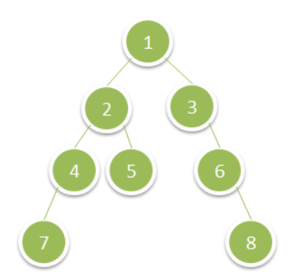

<!-- Don't remove -->
<a name="top"/>

# Trees

Problems and solutions for Trees session on May 8, 2020.

### Table of Contents

* [Problems](#problems)
  * [1](#p1)
  * [2](#p2)
  * [3](#p3)
* [Solutions](#solutions)
  * [1](#s1)
  * [2](#s2)
  * [3](#s3)

<!-- Don't remove -->
<a name="problems"/>

## Problems

<a name="p1"/>

### 1. PROBLEM 1 TODO :bug:

Source: TODO :bug:

#### Scenario

Problem Statement TODO :bug:

#### Example Input

If the problem is simple enough, remove this section. TODO :bug:

#### Function Signature

TODO :bug:

<!-- Don't remove -->
Go to [Solution](#s1)   [Top](#top)

<!-- Don't remove -->
<a name="p2"/>

### 2. Deepest Leaves Sum

Source:[LeetCode](https://leetcode.com/problems/deepest-leaves-sum/)

#### Scenario

Given a binary tree, return the sum of values of its deepest leaves.
Example 1:



Constraints:

- The number of nodes in the tree is between 1 and 10^4.
- The value of nodes is between 1 and 100.

#### Example Input

Input: root = [1,2,3,4,5,null,6,7,null,null,null,null,8]
Output: 15

#### Function Signature

**C++:**
```c++
  //Definition for a binary tree node.
  struct TreeNode {
      int val;
      TreeNode *left;
      TreeNode *right;
      TreeNode() : val(0), left(nullptr), right(nullptr) {}
      TreeNode(int x) : val(x), left(nullptr), right(nullptr) {}
      TreeNode(int x, TreeNode *left, TreeNode *right) : val(x), left(left), right(right) {}
  };
 
 int deepestLeavesSum(TreeNode* root){}
```

<!-- Don't remove -->
Go to [Solution](#s2)   [Top](#top)

<!-- Don't remove -->
<a name="p3"/>

### 3. PROBLEM 3 TODO :bug:

Source: TODO :bug:

#### Scenario

Problem Statement TODO :bug:

#### Example Input

If the problem is simple enough, remove this section. TODO :bug:

#### Function Signature

TODO :bug:

<!-- Don't remove -->
Go to [Solution](#s3)   [Top](#top)

<!-- Don't remove -->
<a name="solutions"/>

## Solutions

<!-- Don't remove -->
<a name="s1"/>

### 1. SOLUTION 1 TODO :bug:

Source: TODO :bug:

#### Naive/Simple Solution

TODO :bug:

#### Optimal Solution

TODO :bug:

#### Testing The Solutions OR Driver For Solution

TODO :bug:

<!-- Don't remove -->
Go to [Top](#top)

<!-- Don't remove -->
<a name="s2"/>

### 2. Deepest Leaves Sum


#### Optimal Solution

<details>
<summary>Click to see solution</summary>

We need the sum of the leaves at the very last level of the tree. To do this, we 
can implement a Breath-first search traversal, tracking the sum of the values of the nodes at each level 
of the tree, and reseting the sum everytime we go to a further level down the tree.
Once we get to the last level, we will get the sum of the value of the nodes at that level, exit the 
loop, and return the sum.

**C++:**
```c++
int deepestLeavesSum(TreeNode* root) {
        
        queue<TreeNode*> queue;
        queue.push(root); // we insert the root into the queue
        int currSum = 0;  //will store the sum of the nodes at the current level
        
        while(!queue.empty()){
            currSum = 0; // reset the sum at each new level of the tree
            int size = queue.size(); // locking the size of the queue at the current level
									//before we add more nodes to it
            
            //for the size of the queue
            for(int i =0; i< size;i++){
                auto node = queue.front();
                // Pop one node of the queue
                queue.pop();
                
                currSum += node->val;
                 //get left child into queue
                if(node->left !=nullptr){
                
                    queue.push(node->left);
                }
                //get right child into queue
                if(node->right !=nullptr){
                    queue.push(node->right);
                }
               
            }   
        }
        return currSum;   
    }
```
	
**Complexity Analysis:**
- Space Complexity:  `O(n)`, because we are using a queue
- Time Complexity:  `O(n)`, because we are traversing the entire tree, node 
by node, and adding them up at each level of the tree.

</details>

#### Testing The Solutions OR Driver For Solution

See [Driver](./DeepestLeavesSum/DeepestLeavesSum.cpp)

<!-- Don't remove -->
Go to [Top](#top)

<!-- Don't remove -->
<a name="s3"/>

### 3. SOLUTION 3 TODO :bug:

Source: TODO :bug:

#### Naive/Simple Solution 

TODO :bug:

#### Optimal Solution

TODO :bug:

#### Testing The Solutions OR Driver For Solution

TODO :bug:

<!-- Don't remove -->
Go to [Top](#top)
