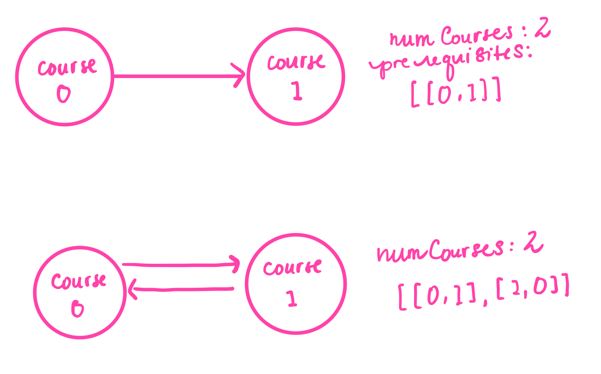
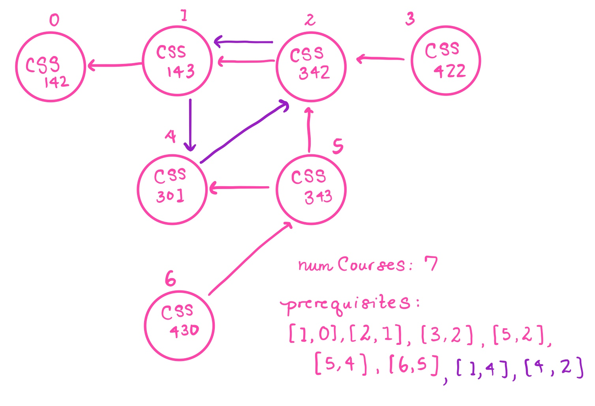
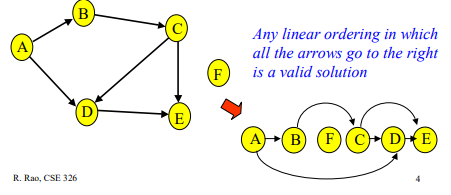

<!-- Don't remove -->
<a name="top"/>

# Topic Name TODO :bug:

Simple description TODO :bug:

In the style of:
***Problems and solutions for Maze & Dynamic Programming session on March 1, 2019.***

### Table of Contents

* [Problems](#problems)
  * [1](#p1)
  * [2](#p2)
  * [3](#p3)
* [Solutions](#solutions)
  * [1](#s1)
  * [2](#s2)
  * [3](#s3)

<!-- Don't remove -->
<a name="problems"/>

## Problems

<a name="p1"/>

### 1. PROBLEM 1 TODO :bug:

Source: TODO :bug:

#### Scenario

Problem Statement TODO :bug:

#### Example Input

If the problem is simple enough, remove this section. TODO :bug:

#### Function Signature

TODO :bug:

<!-- Don't remove -->
Go to [Solution](#s1)   [Top](#top)

<!-- Don't remove -->
<a name="p2"/>

### 2. Course Schedule

Source: [LeetCode](https://leetcode.com/problems/course-schedule/)

#### Scenario

Suppose that you are a college student who is planning on your course schedule.

There are a total of `numCourses` courses that you have to take. 
Each course is labeled from `0` to `numCourses - 1`.

Some of these courses have prerequisites. 
Suppose that course `1` is a prerequisite of course `0`. We can express this relationship with the following pair: `[0, 1]`

Given the total number of courses `numCourses` and a list of prerequisite **pairs**, determine if it is possible for you to finish all of the courses.

#### Example Input

**Example 1**:

Input: `numCourses = 2, prerequisites = [[1, 0]]`
Output: `true`

There are two courses that you must complete.
To complete course 1, you must take course 0. 

It is possible to complete all of thse courses.

**Example 2**:

Input: `numCourses = 2, prerequisites = [[1, 0]]`
Output: `true`

There are two courses you must complete.
To complete course 1, you must take course 0.
However, to complete course 0, you must complete course 1.

There's no way to do this. Thus, this is impossible.


<details>
<summary>Click to see example diagrams</summary>



</details>

#### Function Signature

**Java**

```java

public boolean canFinish(int numCourses, int[][] prerequisites) {

}

```


<!-- Don't remove -->
Go to [Solution](#s2)   [Top](#top)

<!-- Don't remove -->
<a name="p3"/>

### 3. PROBLEM 3 TODO :bug:

Source: TODO :bug:

#### Scenario

Problem Statement TODO :bug:

#### Example Input

If the problem is simple enough, remove this section. TODO :bug:

#### Function Signature

TODO :bug:

<!-- Don't remove -->
Go to [Solution](#s3)   [Top](#top)

<!-- Don't remove -->
<a name="solutions"/>

## Solutions

<!-- Don't remove -->
<a name="s1"/>

### 1. SOLUTION 1 TODO :bug:

Source: TODO :bug:

#### Naive/Simple Solution

TODO :bug:

#### Optimal Solution

TODO :bug:

#### Testing The Solutions OR Driver For Solution

TODO :bug:

<!-- Don't remove -->
Go to [Top](#top)

<!-- Don't remove -->
<a name="s2"/>

### 2. Course Schedule Solution


<details>
<summary>Click to see naive solution</summary>

#### Naive/Simple Solution 

This problem can be modeled as a graph traversal problem. Each course can be represented 

The main idea behind this problem is that if there is a course that is a prerequisite of one of its prerequisites,
there will be a cycle in the corresponding graph.

For example, if we represent `[[1, 0], [0, 1]]` as a directed graph:

* the pair `[1, 0]` is the outgoing edge from vertex 1 to vertex 0
* the pair `[0, 1]` is the outgoing edge from vertex 0 to vertex 1

this forms a directed cycle.



So, in other words, we need to determine if the corresponding graph is a directed acyclic graph.

An easy way to check if a graph has a circle is to perform depth-first search starting from each vertex in the graph.

Before doing this, we'll want to transform `prerequisites`, the list of edges we are given to an adjacency list, which is a more convenient format for performing graph traversal algorithms. Read more about graph representations [here](https://www.khanacademy.org/computing/computer-science/algorithms/graph-representation/a/representing-graphs).


##### Complexity Analysis

* ***Time Complexity***: `O(|E| + |V|^2)`

    * O(|E|) - Time spent building the directed graph data structure
    * O(|V|^2) - For each of the |V| vertices, it could take up to |V| steps to backtrack if the graph is a straight line in the worst case.

* ***Space Complexity***: `O(|E| + |V|)`

    * O(|E| + |V|) - Space occupied by the directed graph data structure
    * O(|V|) - Space occupied to track if each of the vertices have been visited
    * O(|V|) - Max space occupied by the call stack during the recursive calls of DFS in the worst case

<details>
<summary>Click to see naive solution</summary>

```java
    public boolean canFinishNaive(int numCourses, int[][] prerequisites) {
        List<Integer>[] adjacencyList = new List[numCourses];
        boolean[] visited = new boolean[numCourses];

        for (int i = 0; i < numCourses; i++) {
            adjacencyList[i] = new ArrayList();
        }

        for (int i = 0; i < prerequisites.length; i++) {
            int source = prerequisites[i][0];
            int destination = prerequisites[i][1];
            adjacencyList[destination].add(source);
        }

        for (int i = 0; i < numCourses; i++) {
            if (!backtrack(graph, visited, i)) {
                return false;
            }
        }
        return true;
    } 

    private boolean backtrack(List[] graph, boolean[] visited, int course) {
        if (visited[course]) {
            return false;
        } 
        visited[course] = true;
        for (int i = 0; i < graph[course].size(); i++) {
            int start = graph[course].get(i);
            if (!backtrack(graph, visited, start)) {
                return false;
            }
        }
        visited[course] = false;
        return true;
    }

```


</details>

</details>


<details>
<summary>Click to see optimal solution</summary>

#### Optimal Solution

One way to find whether or not a graph is a directed acyclic graph is to check if it has a valid topological ordering.

A topological ordering of a directed graph is a ordering of the vertices of the graph, such that for all edges `(v, w)` in the set of edges of the graph `E`, `v` always comes before `w`.



A common algorithm for finding topological sortings, Kahn's algorithm, is specified below: 

```
G <- Graph that will be ordered
L <- List containing topological ordering output
S <- Set of all vertices with no incoming edges (in-degree 0)

while S is not-empty:
  remove vertex v from S
  add n to end of L

  for each vertex v_i with an edge e from m -> n:
    remove edge e from the graph G
    if v_i has no incoming edges:
      insert(v_i, S)

if graph has edges remaining:
  output "NO TOPOLOGICAL SORTING!"
else:
  output "WE HAVE A TOPOLOGICAL SORTING!"
  return S

```

##### Complexity Analysis

* ***Time Complexity***: `O(|V| + |E|)`

    * O(|E|) - Time spent building the directed graph structure
    * O(|E| + |V|) - Every edge and vertex is visited only once in the worst case.

* ***Space Complexity***: `O(|V| + |E|)`
    * O(|E| + |V|) - Space occupied by the directed graph data structure
    * O(|V|) - Max space occupied to track the courses with no prerequisite (the vertices with in-degree 0)

<details>
<summary>Click to see optimal solution</summary>

```java
    public boolean canFinishOptimal(int numCourses, int[][] prerequisites) {
        int[] incomingEdges = new int[numCourses];
        List<Integer>[] adjacencyList = new List[numCourses];

        for (int i = 0; i < numCourses; i++) {
            adjacencyList[i] = new LinkedList<Integer>();
        }

        for (int[] pair : prerequisites) {
            int source = pair[0];
            int destination = pair[1];
            incomingEdges[source]++;
            adjacencyList[destination].add(source);
        }

        Queue<Integer> queue = new LinkedList<Integer>();
        for (int i = 0; i < incomingEdges.length; i++) {
            if (incomingEdges[i] == 0) {
                queue.add(i);
            }
        }

        int count = prerequisites.length;
        while (!queue.isEmpty()) {
            int current = queue.poll();
            for (int course : adjacencyList[current]) {
                count--;
                incomingEdges[course]--;
                if (incomingEdges[course] == 0) {
                    queue.add(course);
                }
            }
        }
        return count == 0;
    }

```

</details>

</details>

####  Driver For Solution

```java
    public static void main(String[] args) {
        int numCourses1 = 2;
        int[][] prerequisites1 = {{1, 0}};

        int numCourses2 = 2;
        int[][] prerequisites2 = {{1, 0}, {0, 1}};

        System.out.println(canFinish(numCourses1, prerequisites1)); // Expected: true
        System.out.println(canFinish(numCourses2, prerequisites2)); // Expected: false
    }

```

<!-- Don't remove -->
Go to [Top](#top)

<!-- Don't remove -->
<a name="s3"/>

### 3. SOLUTION 3 TODO :bug:


#### Naive/Simple Solution 

TODO :bug:

#### Optimal Solution

TODO :bug:

#### Testing The Solutions OR Driver For Solution

TODO :bug:

<!-- Don't remove -->
Go to [Top](#top)
