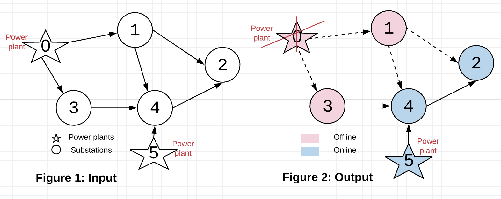
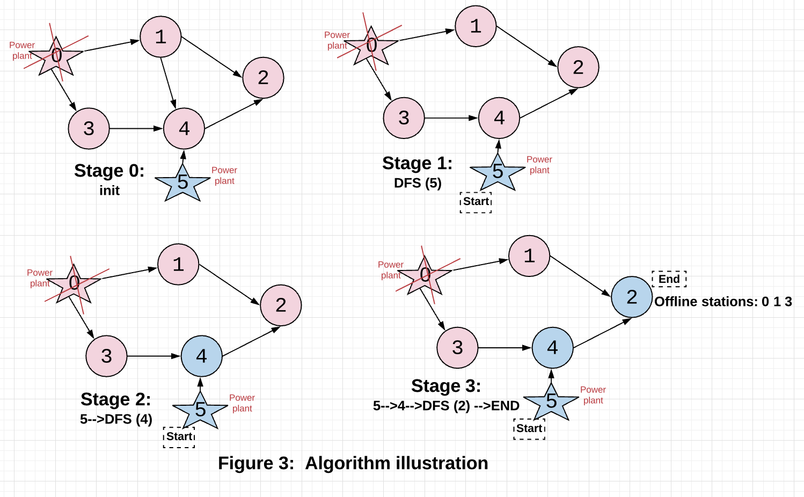

<!-- Don't remove -->
<a name="top"/>

# Graphs

Simple description TODO :bug:

In the style of:
***Problems and solutions for Maze & Dynamic Programming session on March 1, 2019.***

### Table of Contents

* [Problems](#problems)
  * [1](#p1)
  * [2](#p2)
  * [3](#p3)
* [Solutions](#solutions)
  * [1](#s1)
  * [2](#s2)
  * [3](#s3)

<!-- Don't remove -->
<a name="problems"/>

## Problems

<a name="p1"/>

### 1. Lonely on Twitter :bird:

Source: Lizzy

#### Scenario

On Twitter, users can follow other users, but the other users do not have 
to follow the initiator back. In this problem, we want to find the 
loneliest Twitter user -- the account with the highest number of 
followed accounts who did not follow back.

You are given a collection of users, and each user has a collection of accounts 
they are following. This data structure represents the directed graph of a Twitter network. 
Find the user with the highest number of unreciprocated follows.

#### Example Input

Here's a simple example:

```
Input:
    - Mindy: [Mork]
    - Mork: [Mindy]
    - Orson: [Mork, Mindy]
Output: Orson
```

Orson follows both other users, but neither of them follow him. Orson 
is the loneliest user.

```
Input:
    - Peter: [Lois, Chris, Brian]
    - Lois: [Chris, Brian, Stewie]
    - Brian: [Stewie, Lois]
    - Meg: [Peter, Lois, Chris, Brian, Stewie]
    - Chris: [Peter, Lois, Brian]
    - Stewie: []
Output: Meg
```

Meg has followed 5 users, but none of them have reciprocated; she is by far the loneliest user.

#### Function Signature

**D**esign **I**t **Y**ourself. _Hint: what input data structures would be most helpful for this scenario?_

<!-- Don't remove -->
Go to [Solution](#s1)   [Top](#top)

<!-- Don't remove -->
<a name="p2"/>

### 2. Course Schedule

Source: [LeetCode](https://leetcode.com/problems/course-schedule/)

#### Scenario

Suppose that you are a college student who is planning on your course schedule.

There are a total of `numCourses` courses that you have to take. 
Each course is labeled from `0` to `numCourses - 1`.

Some of these courses have prerequisites. 
Suppose that course `1` is a prerequisite of course `0`. We can express this relationship with the following pair: `[0, 1]`

Given the total number of courses `numCourses` and a list of prerequisite **pairs**, determine if it is possible for you to finish all of the courses.

#### Example Input

**Example 1**:

Input: `numCourses = 2, prerequisites = [[1, 0]]`
Output: `true`

There are two courses that you must complete.
To complete course 1, you must take course 0. 

It is possible to complete all of thse courses.

**Example 2**:

Input: `numCourses = 2, prerequisites = [[1, 0], [0, 1]]`
Output: `true`

There are two courses you must complete.
To complete course 1, you must take course 0.
However, to complete course 0, you must complete course 1.

There's no way to do this. Thus, this is impossible.


#### Function Signature

**Java**

```java

public boolean canFinish(int numCourses, int[][] prerequisites) {

}

```


<!-- Don't remove -->
Go to [Solution](#s2)   [Top](#top)

<!-- Don't remove -->
<a name="p3"/>

### 3. Power Stations

Source: Mitchell

#### Scenario

The electrical system of HappyLand consists of ``N`` stations from ``0`` to ``N-1`` including ``M`` power plants where electricity is produced and the rest ``N-M`` stations are used for transmitting electricity, ``M <= N``. After a hurricane, HappyLand’s authorities need to shut down ``K`` station(s) for maintenance. For safety reasons, a shutdown station has no electricity coming in/out of it. To be considered active, a station, unless it is a power plant which can power itself and stations receiving electricity from it, must receive electricity from at least one active station. Otherwise, it is also shut down indirectly. **Find out all stations that are shutdown by disconnecting K stations.**

Each station is represented by a vertex. Directed arrows indicate the electrical dependency between stations (receive from or transfer to its neighboring stations). Each station is guaranteed to be powered by at least one power plant.



#### Example Input
```
N =6; M=2; K=1;
PowPlants[M] = {0,5};
Maint[N] = {0};
Matrix[N][N] = {{0,1,0,1,0,0},
              {0,0,1,0,1,0},
              {0,0,0,0,0,0},
              {0,0,0,0,1,0},
              {0,0,1,0,0,0},
              {0,0,0,0,1,0}};
```
#### Example Output
Offline stations:
```
0 1 3
```
<details>
<summary>Click to see explanation</summary>

##### Explanation:
There are 6 stations. 2 power plants are 0 and 5. Station 0 is shut down for maintenance.

Shutting down station 0 shuts down station 1 and 3 as they only receive electricity from power plant 1. Stations 2 is powered by active station 4, which is powered by active power plant 5, also active.
</details>

#### Function Signature
C++:

```c++
// Definition of Graph
struct Graph {
    explicit Graph() = default;
    int N,M,K;
    vector<vector<bool> > Matrix;
    vector<int> PowPlants;
    vector<int> Maint;
};

void Solve(Graph &G) {
    // your code goes here

}
```
Java:

```Java
// Definition of Graph
static class Graph {
    public Graph() { }
    public int N,M,K;
    public int Matrix[][];
    public int PowPlants[];
    public int Maint[];
}
public static void Solve(Graph G) {
    // your code goes here

}

```

<!-- Don't remove -->
Go to [Solution](#s3)   [Top](#top)

<!-- Don't remove -->
<a name="solutions"/>

## Solutions

<!-- Don't remove -->
<a name="s1"/>

### 1. Lonely on Twitter :bird:

Source: Lizzy

#### Solution

We want to track how much lower the reciprocation of each follow 
is for each user. So, we inspect each user, and one by one, we 
inspect that user's followed list. We lookup that followed account 
and see if the user is in the followed account's set; if it is, 
the follow is reciprocated. If it is not, we subtract 1 from the 
differential.

<details>
<summary>See Python3 solution</summary>

```python3
def lonely(users: dict) -> str:
    # users is a dictionary with K:V of str:set
    if not users: return None

    # create differential
    diff = {}
    for user in users:
        diff[user] = 0
        for followed in users[user]:
            if user not in users[followed]: 
                diff[user] -= 1

    # transform differential data into a list of pairs
    result = [(user, count) for user, count in diff.items()]
    # sort list of pairs by differential, lowest to highest
    result.sort(key=lambda x: x[1])
    return result[0][0]
```

</details>

What is wrong with this solution, if anything?

<details>
<summary>What's wrong</summary>

1. This solution doesn't account for multiple users having the same 
   follower differential, and only takes the first available answer.
2. The manipulation of the differential data is not particularly 
   efficient in runtime, although the code is concise and readable. 
   The list comprehension has a time complexity of `O(N^2)` because 
   lists with appended items are rebuilt in each iteration. The sort 
   call has an optimal time complexity of `O(n log n)`.

</details>

#### Testing The Solution

See the [solution method](./lonely_twitter/solution.py) and [driver](./lonely_twitter/driver.py) containing tests.

<details>
<summary>Test output</summary>

```console
$ python3 driver.py
User graph:
{
         Bob :  {'Theo', 'Rachel', 'Frank', 'Sandy'}
         Sandy :  {'Sally', 'Theo'}
         Frank :  {'Sally', 'Rachel', 'Sandy', 'Theo'}
         Theo :  {'Sally', 'Bob'}
         Sally :  set()
         Rachel :  {'Sally'}
}
The loneliest user is Frank 

User graph:
{
         Mindy :  {'Mork'}
         Mork :  {'Mindy'}
         Orson :  {'Mindy', 'Mork'}
}
The loneliest user is Orson 

User graph:
{
         Peter :  {'Brian', 'Chris', 'Lois'}
         Lois :  {'Chris', 'Stewie', 'Brian'}
         Brian :  {'Stewie', 'Lois'}
         Meg :  {'Stewie', 'Brian', 'Peter', 'Lois', 'Chris'}
         Chris :  {'Brian', 'Peter', 'Lois'}
         Stewie :  set()
}
The loneliest user is Meg
```

</details>

<!-- Don't remove -->
Go to [Top](#top)

<!-- Don't remove -->
<a name="s2"/>

### 2. Course Schedule Solution


<details>

<summary>Click to see naive solution</summary>

#### Naive/Simple Solution 

This problem can be modeled as a graph traversal problem. Each course can be represented 

The main idea behind this problem is that if there is a course that is a prerequisite of one of its prerequisites,
there will be a cycle in the corresponding graph.

For example, if we represent `[[1, 0], [0, 1]]` as a directed graph:

* the pair `[1, 0]` is the outgoing edge from vertex 1 to vertex 0
* the pair `[0, 1]` is the outgoing edge from vertex 0 to vertex 1

this forms a directed cycle.


So, in other words, we need to determine if the corresponding graph is a directed acyclic graph.

An easy way to check if a graph has a circle is to perform depth-first search starting from each vertex in the graph.

Before doing this, we'll want to transform `prerequisites`, the list of edges we are given to an adjacency list, which is a more convenient format for performing graph traversal algorithms. Read more about graph representations [here](https://www.khanacademy.org/computing/computer-science/algorithms/graph-representation/a/representing-graphs).


##### Complexity Analysis

* ***Time Complexity***: `O(|E| + |V|^2)`

    * O(|E|) - Time spent building the directed graph data structure
    * O(|V|^2) - For each of the |V| vertices, it could take up to |V| steps to backtrack if the graph is a straight line in the worst case.

* ***Space Complexity***: `O(|E| + |V|)`

    * O(|E| + |V|) - Space occupied by the directed graph data structure
    * O(|V|) - Space occupied to track if each of the vertices have been visited
    * O(|V|) - Max space occupied by the call stack during the recursive calls of DFS in the worst case

<details>
<summary>Click to see implementation of naive solution</summary>

```java
    public boolean canFinishNaive(int numCourses, int[][] prerequisites) {
        List<Integer>[] adjacencyList = new List[numCourses];
        boolean[] visited = new boolean[numCourses];

        for (int i = 0; i < numCourses; i++) {
            adjacencyList[i] = new ArrayList();
        }

        for (int i = 0; i < prerequisites.length; i++) {
            int source = prerequisites[i][0];
            int destination = prerequisites[i][1];
            adjacencyList[destination].add(source);
        }

        for (int i = 0; i < numCourses; i++) {
            if (!backtrack(graph, visited, i)) {
                return false;
            }
        }
        return true;
    } 

    private boolean backtrack(List[] graph, boolean[] visited, int course) {
        if (visited[course]) {
            return false;
        } 
        visited[course] = true;
        for (int i = 0; i < graph[course].size(); i++) {
            int start = graph[course].get(i);
            if (!backtrack(graph, visited, start)) {
                return false;
            }
        }
        visited[course] = false;
        return true;
    }

```


</details>

</details>


<details>
<summary>Click to see optimal solution</summary>

#### Optimal Solution

One way to find whether or not a graph is a directed acyclic graph is to check if it has a valid topological ordering.

A topological ordering of a directed graph is a ordering of the vertices of the graph, such that for all edges `(v, w)` in the set of edges of the graph `E`, `v` always comes before `w`.


A common algorithm for finding topological sortings, Kahn's algorithm, is specified below: 

```
G <- Graph that will be ordered
L <- List containing topological ordering output
S <- Set of all vertices with no incoming edges (in-degree 0)

while S is not-empty:
  remove vertex v from S
  add n to end of L

  for each vertex v_i with an edge e from m -> n:
    remove edge e from the graph G
    if v_i has no incoming edges:
      insert(v_i, S)

if graph has edges remaining:
  output "NO TOPOLOGICAL SORTING!"
else:
  output "WE HAVE A TOPOLOGICAL SORTING!"
  return S

```

##### Complexity Analysis

* ***Time Complexity***: `O(|V| + |E|)`

    * O(|E|) - Time spent building the directed graph structure
    * O(|E| + |V|) - Every edge and vertex is visited only once in the worst case.

* ***Space Complexity***: `O(|V| + |E|)`
    * O(|E| + |V|) - Space occupied by the directed graph data structure
    * O(|V|) - Max space occupied to track the courses with no prerequisite (the vertices with in-degree 0)

<details>
<summary>Click to see implementation of optimal solution</summary>

```java
    public boolean canFinishOptimal(int numCourses, int[][] prerequisites) {
        int[] incomingEdges = new int[numCourses];
        List<Integer>[] adjacencyList = new List[numCourses];

        for (int i = 0; i < numCourses; i++) {
            adjacencyList[i] = new LinkedList<Integer>();
        }

        for (int[] pair : prerequisites) {
            int source = pair[0];
            int destination = pair[1];
            incomingEdges[source]++;
            adjacencyList[destination].add(source);
        }

        Queue<Integer> queue = new LinkedList<Integer>();
        for (int i = 0; i < incomingEdges.length; i++) {
            if (incomingEdges[i] == 0) {
                queue.add(i);
            }
        }

        int count = prerequisites.length;
        while (!queue.isEmpty()) {
            int current = queue.poll();
            for (int course : adjacencyList[current]) {
                count--;
                incomingEdges[course]--;
                if (incomingEdges[course] == 0) {
                    queue.add(course);
                }
            }
        }
        return count == 0;
    }

```

</details>

</details>

####  Driver For Solution

```java
    public static void main(String[] args) {
        int numCourses1 = 2;
        int[][] prerequisites1 = {{1, 0}};

        int numCourses2 = 2;
        int[][] prerequisites2 = {{1, 0}, {0, 1}};

        System.out.println(canFinish(numCourses1, prerequisites1)); // Expected: true
        System.out.println(canFinish(numCourses2, prerequisites2)); // Expected: false
    }

```

<!-- Don't remove -->
Go to [Top](#top)

<!-- Don't remove -->
<a name="s3"/>

### 3. Power Stations

Instead of validating the status of current vertex by checking vertices(stations) it relies on, we could approach the problem top-down: we assume that all stations are shut down. Starting with known power plant that remains active, we activate adjacent stations and substations of the current active station using DFS.Stations that are not activated by the end of the algorithm are the ones affected by shutting down K stations.

<details>
<summary>Click to see the algorithm illustration</summary>


</details>

###### Pseudocode
```
void Solve() {
  -> mark all stations as Offline
  -> mark power plants that are in maintenance as Offline
  // start marking from active power plants i-th
  for (i : M) {
    if (PowPlants[i] is active)
      DFS(PowPlants[i]);
  }
}
void DFS(int Cur) {
  if (Cur is in maintenance) return; // stop checking

  // Otherwise mark Cur as active and visited
  Visited[Cur] = true;
  Active[Cur] = true;

  // check its adjacent
  for (i : N) {
    // if i is not visited and has path from Cur->i
    if (!Visited[i] && Matrix[Cur][i])
      DFS(i);
  }
}
```
###### Source code
<details>
<summary>Click to see C++ source code</summary>

```c++

class Solution{
public:
    vector<bool> Maint;
    vector<bool> PowPlants;
    void DFS(Graph &G, int Cur, vector<bool> &ActiveStas, vector<bool> &Visited) {
        if (Maint[Cur]) return;
        Visited[Cur] = true;
        ActiveStas[Cur] = true;
        for (int i=0; i<G.N; i++) {
            if (i!=Cur && !Visited[i] && G.Matrix[Cur][i]) {
                DFS(G, i, ActiveStas, Visited);
            }
        }
    }
    void Solve(Graph &G) {
        // init
        Maint = vector<bool>(G.N);
        PowPlants = vector<bool>(G.N);
        for (int i=0; i<G.K; i++)
            Maint[G.Maint[i]] = true;
        for (int i=0; i<G.M; i++)
            PowPlants[G.PowPlants[i]] = true;

        // assuming all stations are off except active power plants
        vector<bool> ActiveStas(G.N);
        vector<bool> Visited(G.N);
        for (int i=0; i<G.N; i++) {
            ActiveStas[i] = false;
            if (PowPlants[i] && !Maint[i]) ActiveStas[i] = true;
            Visited[i] = false;
        }

        // using DFS to mark stations that connected to
        // known active stations
        for (int i=0; i<G.M; i++) {
            if (ActiveStas[G.PowPlants[i]])
                DFS(G, G.PowPlants[i], ActiveStas, Visited);
        }

        // print out offline stations at the end
        for (int i=0; i<G.N; i++) {
            if (ActiveStas[i]) continue;
            cout << i << " ";
        }
        cout << endl;
    }
};

```
</details>

<details>
<summary>Click to see Java source code</summary>

```Java
static class Graph {
      public Graph() { }
      public int N,M,K;
      public int Matrix[][];
      public int PowPlants[];
      public int Maint[];
}

static boolean Maint[];
static boolean PowPlants[];
private static void DFS(Graph G, int Cur, boolean ActiveStas[], boolean Visited[]) {
    if (Maint[Cur]) return;
    Visited[Cur] = true;
    ActiveStas[Cur] = true;
    for (int i=0; i<G.N; i++) {
        if (i!=Cur && !Visited[i] && G.Matrix[Cur][i] == 1) {
            DFS(G, i, ActiveStas, Visited);
        }
    }
}
public static void Solve(Graph G) {
    // init
    Maint = new boolean[G.N];
    PowPlants = new boolean[G.N];
    for (int i=0; i<G.K; i++)
        Maint[G.Maint[i]] = true;
    for (int i=0; i<G.M; i++)
        PowPlants[G.PowPlants[i]] = true;

    // assuming all stations are off except active power plants
    boolean ActiveStas[] = new boolean[G.N];
    boolean Visited[] = new boolean[G.N];
    for (int i=0; i<G.N; i++) {
        ActiveStas[i] = false;
        if (PowPlants[i] && !Maint[i]) ActiveStas[i] = true;
        Visited[i] = false;
    }

    // using DFS to mark stations that connected to
    // known active stations
    for (int i=0; i<G.M; i++) {
        if (ActiveStas[G.PowPlants[i]])
            DFS(G, G.PowPlants[i], ActiveStas, Visited);
    }

    // print out offline stations at the end
    for (int i=0;i<G.N; i++) {
        if (ActiveStas[i]) continue;
        System.out.print(i +" ");
    }
    System.out.println();
}

```

</details>

###### Time complexity:

- Best and average case: when M is significantly small to N, it is ``O(M*N)``.
- Worst case: when M is close to N or M==N, the algorithm has the same complexity as that of DFS which is ``O(N^2)``.


#### Driver for solution

See C++ [Driver](./PowerStations/PowerStations.cpp)


See Java [Driver](./PowerStations/PowerStations.java)


<!-- Don't remove -->
Go to [Top](#top)
