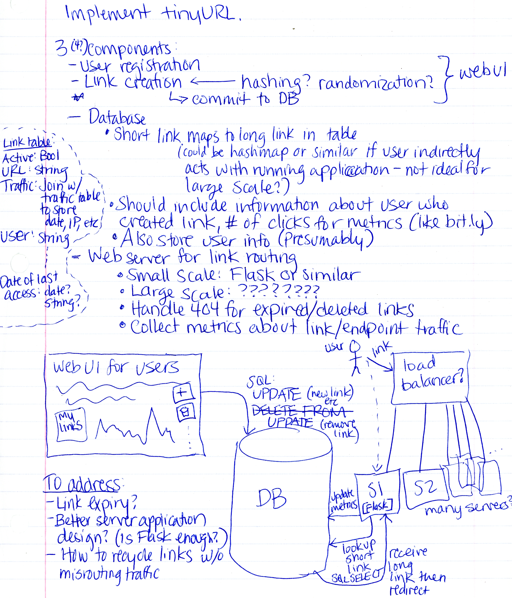

# Miscellaneous Coding & System Design

Problems and solutions for Miscellaneous Coding & System Design session on May 17, 2019.

## Problems

### 1. PROBLEM 1 TODO :bug:

Source: TODO :bug:

#### Scenario

Problem Statement TODO :bug:

#### Example Input

If the problem is simple enough, remove this section. TODO :bug:

#### Function Signature

TODO :bug:

### 2. PROBLEM 2 TODO :bug:

Source: TODO :bug:

#### Scenario

Problem Statement TODO :bug:

#### Example Input

If the problem is simple enough, remove this section. TODO :bug:

#### Function Signature

TODO :bug:

### 3. TinyURL

Source: CTCI Chapter 9

#### Scenario

Design a service that produces and manages minified URLs.

#### Questions to Consider

1. As a user, how would you use such a service? What would you expect 
   from the service?
2. What are some core (necessary) features of such a service? Are there 
   additional features that would be useful?
3. How would you store the destination URL? How would you generate it?
4. Should minified links expire?
5. Do you need to make any considerations for deploying this system?

## Solutions

### 1. PROBLEM 1 TODO :bug:

Source: TODO :bug:

#### Naive/Simple Solution

TODO :bug:

#### Optimal Solution

TODO :bug:

#### Testing The Solutions OR Driver For Solution

TODO :bug:

### 2. PROBLEM 2 TODO :bug:

Source: TODO :bug:

#### Naive/Simple Solution

TODO :bug:

#### Optimal Solution

TODO :bug:

#### Testing The Solutions OR Driver For Solution

TODO :bug:

### 3. TinyURL

Source: CTCI Chapter 9

#### Taking a First Crack at the Problem

Here's a rough sketch of ideas, potential system components, and 
design considerations:

#### A Short Writeup

TinyURL would have 2 primary classes of customers:

- Users who generate and manage links
- Individuals who receive the distributed links and visit the link (and 
  get redirected to the target destination)

To serve the first class of customers effectively, a web-based UI with 
registration and account persistence makes the most sense. Users can log 
in, create links, and update/delete links as desired.

To serve the second class of customers, a web server (or cluster of 
servers) would need to receive the traffic for the minified URL and 
redirect the visitor to the target URL.

A database is needed to store the minified links, along with other pertinent 
information about the link. Using a database would allow for tracking 
the number of hits for the link, whether the link is active or 
expired/deleted, and other useful information as necessary. The database 
might also contain a separate table for the traffic associated with the 
links, so that the IP address and access date for each individual hit 
can be tracked.

Additionally, user information (credentials, created links, etc.) will 
be stored in the database.

The web server(s) used to serve the minified links is a subset of this 
system that requires careful design inofitself. The expected traffic for 
the link service is the most important consideration for implementation 
details. The diagram above describes an outline for using a load 
balancer to ensure individual servers do not get overwhelmed with traffic, 
and each individual server will be able to connect with a centralized 
database. The web application handling the database access requests 
each time a link is accessed could be a number of platforms; `Flask` 
has been proposed for small-scale solutions.
