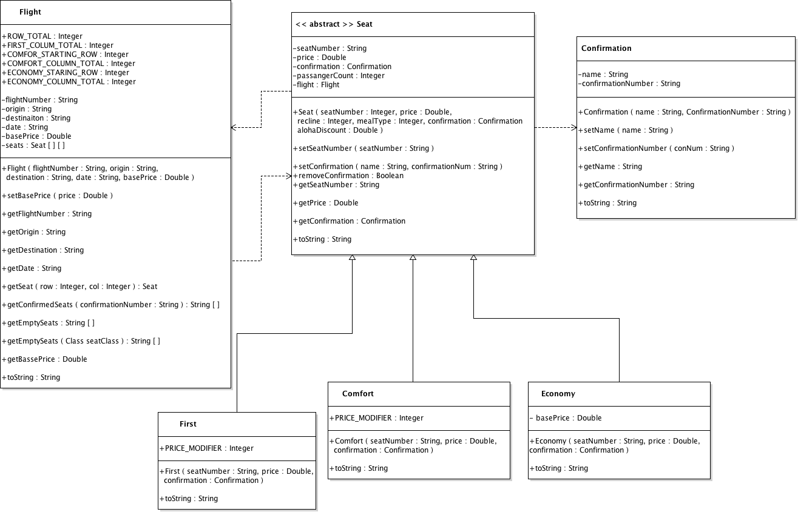

# Miscellaneous Coding & System Design

Problems and solutions for Miscellaneous Coding & System Design session on May 17, 2019.

## Problems

### 1. Flight Reservations

Source: Tom Blanchard

#### Scenario

A plane has 300 seats; 50 first class seats, 50 comfort seats and 200 economy seats.
The airline must have a way for customers to reserve their seats. How would you design a system for 
keeping track of customers reserving seats, managing confirmations, and making sure that 
seats on the plane are not over booked. Create a UML class diagram illustrating the 
relationship between any classes you would need to represent this reservation system.

### 2. PROBLEM 2 TODO :bug:

Source: TODO :bug:

#### Scenario

Problem Statement TODO :bug:

#### Example Input

If the problem is simple enough, remove this section. TODO :bug:

#### Function Signature

TODO :bug:

### 3. PROBLEM 3 TODO :bug:

Source: TODO :bug:

#### Scenario

Problem Statement TODO :bug:

#### Example Input

If the problem is simple enough, remove this section. TODO :bug:

#### Function Signature

TODO :bug:

## Solutions

### 1. Flight Reservation UML Class Diagram
This diagram can be located in `Spring-2019/system_design_misc_coding/Flight_Reservation/Flight_Reservation_System.png`

### 2. PROBLEM 2 TODO :bug:

Source: TODO :bug:

#### Naive/Simple Solution

TODO :bug:

#### Optimal Solution

TODO :bug:

#### Testing The Solutions OR Driver For Solution

TODO :bug:

## 3. PROBLEM 3 TODO :bug:

Source: TODO :bug:

#### Naive/Simple Solution 

TODO :bug:

#### Optimal Solution

TODO :bug:

#### Testing The Solutions OR Driver For Solution

TODO :bug:

