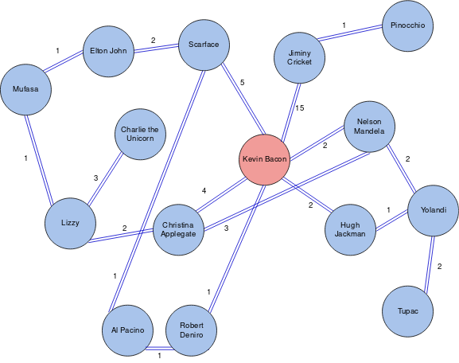

# Trees & Graphs

Problems and solutions for Trees & Graphs session on May 24, 2019.

## Problems

### 1. PROBLEM 1 TODO :bug:

Source: TODO :bug:

#### Scenario

Problem Statement TODO :bug:

#### Example Input

If the problem is simple enough, remove this section. TODO :bug:

#### Function Signature

TODO :bug:

### 2. PROBLEM 2 TODO :bug:

Source: TODO :bug:

#### Scenario

Problem Statement TODO :bug:

#### Example Input

If the problem is simple enough, remove this section. TODO :bug:

#### Function Signature

TODO :bug:

### 3. Six Degrees of Kevin Bacon

Source: Lizzy Presland

#### Scenario

The term "Six Degrees of Separation" describes how any two people on 
Earth can be associated by no more than six intermediary people. These 
relationships can easily be represented in a graph structure. A 
popular reimagining of this problem is 
["Six Degrees of Kevin Bacon"](https://en.wikipedia.org/wiki/Six_Degrees_of_Kevin_Bacon), 
which we will explore in this problem.

#### Part I

In the graph given below, use the weighted edges to determine which 
individuals which are within six degrees of Kevin Bacon. 



#### Part II

Write code (or pseudocode) to determine which nodes, if any, are within 6 degrees of 
Kevin Bacon.

##### Function Signature

The C++ function would be defined as follows:

```c++
vector<Node*> Graph::sixDegreesOfBacon();
```

For convenience, the header file of the `Graph` and `Node` classes 
are listed below with all essential methods for this problem.

```c++
using namespace std;

class Graph {
    public:
        Graph();
        ~Graph();
        Node* getNode(string nodeName);
    private:
        set<Node*> nodes;
};

class Node {
    public:
        Node(string name);
        ~Node();
        vector<pair<Node*, int>*>* getEdges();
        string getName();
    private:
        vector<pair<Node*, int>*>* edges;
        string name;
};
```

## Solutions

### 1. PROBLEM 1 TODO :bug:

Source: TODO :bug:

#### Naive/Simple Solution

TODO :bug:

#### Optimal Solution

TODO :bug:

#### Testing The Solutions OR Driver For Solution

TODO :bug:

### 2. PROBLEM 2 TODO :bug:

Source: TODO :bug:

#### Naive/Simple Solution

TODO :bug:

#### Optimal Solution

TODO :bug:

#### Testing The Solutions OR Driver For Solution

TODO :bug:

### 3. Six Degrees of Kevin Bacon

Source: Lizzy Presland

#### Solution

The solution for this problem is a specialized version of Dijkstra's 
algorithm. The use of tenets of the algorithm is important because 
multiple different paths may lead to the same node, and we want to 
progress if a smaller path allows more subsequent nodes to be found.

A pseudocode algorithm for the implementation might look something like this:

TODO :bug: fix the pseudocode after implementation is done

```
// edge case
check the graph's set of nodes for "Kevin Bacon"; return null if absent
// graph search setup
create:
    a set of objects which contain a valid node and the weight sum to access that node from Kevin Bacon
    a queue of nodes to check next, containing the node and the neighbor's weight
add all of Kevin Bacon's neighbors to the queue
// conduct a breadth-first search of the graph
while the queue is not empty:
    get weightsum of current path (predecessor weight + queue item's weight)
    if weightsum > 6; do not proceed with current item
    else:
        if the queue item is not in the set of objects:
            check to make sure the weight value is less than 6
            if this check passes, add the queue item to the set
        otherwise (the queue item is in the set):
            take the set item's current weightsum
            compare with weightsum of current path we are travelling
            if current path has lower weightsum, replace the weightsum in the set
       add all neighbors of current queue item to queue
        
```

#### Testing The Solutions OR Driver For Solution

TODO :bug:


