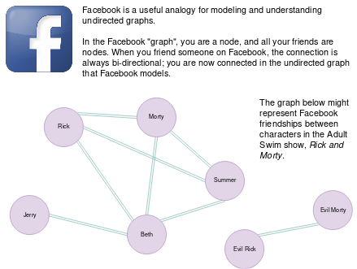
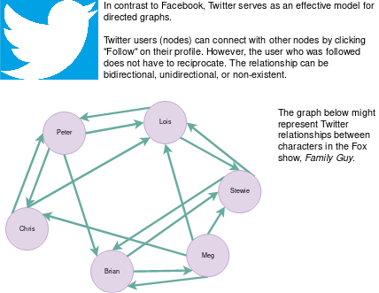

# Trees & Graphs

Problems and solutions for Trees & Graphs session on May 24, 2019.

## Background

### What is a tree?

A `tree` is a data structure that organizes information according to 
a heirarchy. As its name suggests, all items (or `nodes`) in a tree 
originate from a single node, and this organization is analogous to a 
tree's root system. The originating node is usually called the `root`.

A tree node contains the following items:
- A pointer, reference, or value called `data`
- References or pointers to child nodes

We will review two of the most common types of trees: **binary trees** 
and **binary search trees**.

#### Binary Tree

A binary tree is structured so that any node can have no more than 
two children.

A node with no children is called a leaf node. 

A binary tree has no inherent order to how data is added to the tree 
or organized inside the tree. However, the structure of the tree itself 
is guaranteed (that is, any node in a binary tree has either 0, 1, or 2 
children).

A binary tree can be defined in C++ as follows:

```c++
<template typename T>
class BinaryTree {
    public:
    private:
        Node root;
}
```

A binary tree node can be defined in C++ as follows:

```c++
<template typename T>
struct Node {
    T data;
    Node leftChild;
    Node rightChild;
};
```

An example of a binary tree that contains integers is:


#### Binary Search Tree

A binary search tree (BST) has all of the same properties as a binary 
tree, but also has the following additional property:

**In the BST, each node's left-hand subtree has data which is comparatively 
*smaller* than its own data. 
Similarly, each node's right-hand subtree has data which is comparatively 
*larger* than its own data.**

This property implies inherent order in the tree's data. Searching for a 
particular item in a BST is quite efficient, with a typical runtime time 
complexity of `O(log N)`.

An example of a binary search tree that contains characters is:


### What is a graph?

A graph is also a data structure that organizes and shows relationships 
between individual data nodes. However, a graph is not organized in a 
heirarchal way the way a tree is. Nodes in a graph are not required 
to be connected, and connections (or _edges_) between nodes can be 
created and destroyed dynamically.

It is useful to observe that a tree is a form of an undirected graph.

Graphs are meaningful in the context of computer science because they 
are an excellent model for social interactions. Most social media interactions 
can be represented using graphs.

#### Undirected Graphs



#### Directed Graphs



#### Weighted Graphs

Until now, we have looked at graphs whose connections do not have any 
special qualities. A common quality that graph edges might possess are 
_weights_. Weights are usually associated with a cost or benefit of 
the relationship between the nodes. 

Consider a graph which represents 
a map of highways between major US cities. Each graph edge, representing 
a highway, might have a _weight_ that represents the number of miles 
between those cities using that highway. This data structure can be 
used to calculate the shortest route between two different cities, 
for example. For more information about this subclass of problems, 
we recommend reading about 
[Dijkstra's Algorithm](https://en.wikipedia.org/wiki/Dijkstra's_algorithm).

## Problems

### 1. PROBLEM 1 TODO :bug:

Source: TODO :bug:

#### Scenario

Problem Statement TODO :bug:

#### Example Input

If the problem is simple enough, remove this section. TODO :bug:

#### Function Signature

TODO :bug:

### 2. PROBLEM 2 TODO :bug:

Source: TODO :bug:

#### Scenario

Problem Statement TODO :bug:

#### Example Input

If the problem is simple enough, remove this section. TODO :bug:

#### Function Signature

TODO :bug:

### 3. PROBLEM 3 TODO :bug:

Source: TODO :bug:

#### Scenario

Problem Statement TODO :bug:

#### Example Input

If the problem is simple enough, remove this section. TODO :bug:

#### Function Signature

TODO :bug:

## Solutions

### 1. PROBLEM 1 TODO :bug:

Source: TODO :bug:

#### Naive/Simple Solution

TODO :bug:

#### Optimal Solution

TODO :bug:

#### Testing The Solutions OR Driver For Solution

TODO :bug:

### 2. PROBLEM 2 TODO :bug:

Source: TODO :bug:

#### Naive/Simple Solution

TODO :bug:

#### Optimal Solution

TODO :bug:

#### Testing The Solutions OR Driver For Solution

TODO :bug:

## 3. PROBLEM 3 TODO :bug:

Source: TODO :bug:

#### Naive/Simple Solution 

TODO :bug:

#### Optimal Solution

TODO :bug:

#### Testing The Solutions OR Driver For Solution

TODO :bug:


